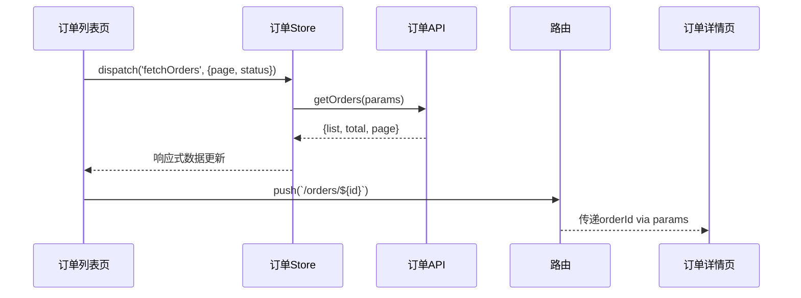

# Coral 前端全流程协作开发技能

## 核心原则

不急于写代码。先理清需求，再拆分任务，最后以测试用例为准驱动开发。任何阶段遇到疑问，必须先向用户确认，再继续推进。

本技能是 coral-frontend 的上游流程 — 完成从需求到开发规划的完整链路后，交接给 coral-frontend 执行实际编码。

---

## 阶段总览

```
阶段0: 项目模式识别
  ↓
阶段1: 需求分析（产品经理视角）→ PRD + 原型
  ↓
阶段2: UI/UX 设计（设计师视角）→ 偏好调研 → 趋势调研 → 多方案HTML → 用户选定 → 模块设计稿
  ↓
阶段3: 逻辑梳理与技术方案（架构师视角）→ 流程图 + 交互时序图 + 集成契约 + 技术选型
  ↓
阶段4: 测试用例编写（测试视角）→ 功能用例 + 集成用例 + 端到端用例
  ↓
阶段5: 任务拆分与分配（项目经理视角）→ 共享接口先行 + 并行任务 + 集成拼装收尾
  ↓
阶段6: 开发执行（交接 coral-frontend）
  6.1 共享接口定义（T-001，最先执行）
  6.2 并行开发（多个 Agent 并行）
  6.3 集成拼装 + 冒烟测试（最后执行）
  ↓
阶段7: 功能测试（测试工程师视角）→ 端到端优先 → 集成 → 功能
  ↓
阶段8: 回归测试与交付（项目经理视角）→ 整体验收
```

每个阶段完成时，将进度写入 `docs/workflow/progress.json`（结构化）和 `docs/workflow/progress.md`（可读），并在 memory 中记录关键状态，实现双保险上下文管理。

---

## 阶段 0：项目模式识别

判断当前项目属于哪种模式，后续所有流程据此调整：

**模式 A — 从0创建项目：** 无现有代码库。需额外产出：技术选型方案、项目脚手架、规范文档。

**模式 B — 已有项目迭代：** 存在运行中的代码库。需额外产出：当前项目规范文档（编码规范、目录结构、组件规范、接口规范、UI风格指南），读取 `references/project-spec.md`（如果存在）。

**执行：** 使用 AskUserQuestion 确认项目模式。若为模式B，先分析现有项目代码结构生成规范文档，存入 `docs/workflow/project-spec.md`。

---

## 阶段 1：需求分析（产品经理视角）

### 1.1 需求澄清

以产品经理身份向用户提问，每次不超过5个问题，等用户回答后再追问下一批。澄清维度：

- 业务目标：解决什么问题？面向什么用户？
- 核心场景：主要使用场景？优先级？
- 边界条件：异常场景怎么处理？
- 数据流向：数据从哪来？到哪去？权限？
- 交互偏好：有没有参考产品？风格偏好？
- 交付约束：截止时间？依赖的外部系统？

不假设答案，不跳过疑问。

### 1.2 产出 PRD 文档

需求澄清完成后，生成结构化 PRD。模板见 `references/prd-template.md`，保存到 `docs/workflow/prd.md` + `docs/workflow/prd.json`。

### 1.3 产出原型图

根据 PRD 生成 HTML 原型预览页面：
- 低保真线框图级别
- 覆盖核心页面和关键交互流程
- 标注页面跳转关系
- 模式B需标注与现有页面的关联

保存到 `docs/workflow/prototype/index.html`。

---

## 阶段 2：UI/UX 设计（设计师视角）

本阶段分四步走：偏好调研 → 方案探索 → 用户选定 → 详细设计稿。不直接出设计，先了解用户要什么、行业在做什么，再动手。

### 2.1 设计偏好调研

以设计师身份向用户提问，了解设计方向，每次不超过5个问题：

```
- 风格偏好：简约专业 / 活泼年轻 / 沉稳大气 / 其他？
- 参考产品：有没有觉得设计好的产品？（给名字或截图路径）
- 色彩倾向：主色偏好？冷色/暖色/中性？品牌色？
- 目标用户群审美：用户是年轻人/中年/企业用户？不同群体对视觉的期望不同
- 情绪关键词：希望用户看到产品时的第一感受？（高效、安心、愉悦、专业...）
- 竞品设计：有没有觉得设计不好的竞品？哪里不好？
```

**模式B额外询问：**
- 对现有系统UI的满意度？哪些地方觉得丑/不统一？
- 新功能是要融入现有风格，还是可以建立独立视觉分区？

### 2.2 设计趋势调研

根据用户偏好和项目类型，使用 WebSearch 工具搜索当下相关领域的优秀设计实践：

```
搜索维度：
- "{项目类型} UI design trends 2026" — 当下主流设计趋势
- "{功能类型} best UI examples" — 同类功能的优秀设计案例
- "{风格关键词} dashboard/admin/landing page design" — 对应风格的设计参考
- "{参考产品名} design system" — 用户提到的参考产品的设计体系
```

调研结果整理为简报，保存到 `docs/workflow/design-research.md`：
- 3-5个优秀设计案例的截图/链接和亮点分析
- 当前趋势总结（如：大圆角、玻璃态、渐变、微交互等哪些适合本项目）
- 与用户偏好的匹配分析

### 2.3 多方案设计探索

基于用户偏好 + 行业调研，产出 **2-3个不同方向**的设计方案，每个方案以 HTML 页面呈现，保存到 `docs/workflow/design-options/`：

```
docs/workflow/design-options/
├── option-A.html    # 方案A（如：简约专业风）
├── option-B.html    # 方案B（如：活力年轻风）
└── option-C.html    # 方案C（如：沉稳商务风）
```

每个 HTML 方案必须包含：

**视觉风格板（Mood Board）：**
- 主色 / 辅色 / 功能色（成功/警告/错误） / 中性色
- 字体：标题字体 + 正文字体，含字重和字号层级
- 间距体系（4px/8px/12px/16px/24px/32px）
- 圆角规范（小组件/卡片/弹窗）
- 阴影层级
- 按钮样式（主要/次要/文字按钮，含hover/active/disabled状态）

**典型页面预览：**
- 1-2个核心页面的高保真 HTML 渲染
- 展示该方案下的真实视觉效果

**方案说明：**
- 风格定位一句话描述
- 适合的用户群和场景
- 与竞品的差异化
- 优势与局限

**模式B约束：** 如果是已有项目迭代，方案C可以是"延续现有风格"的选项，方便用户在"保持一致"和"焕新升级"之间选择。

### 2.4 用户选定

将2-3个方案呈现给用户选择。使用 AskUserQuestion 让用户：
- 选定一个方向
- 也可以混搭：从方案A取配色，从方案B取布局，从方案C取交互风格
- 补充修改意见

用户选定后，记录选择结果和修改意见到 `docs/workflow/design-decision.md` + `design-decision.json`。

### 2.5 详细设计稿产出

基于用户选定的方案，逐模块产出详细 HTML 设计稿。每个功能模块一个独立 HTML 文件：

```
docs/workflow/design-specs/
├── module-attendance.html    # 考勤管理模块
├── module-leave.html         # 请假管理模块
├── module-overtime.html      # 加班管理模块
├── module-report.html        # 统计报表模块
└── shared-components.html    # 共享组件库
```

**每个模块的 HTML 设计稿必须包含：**

**A. 完整页面布局**
- 页面的每一个区域都必须渲染出来，不能有占位符或"此处省略"
- 包含导航栏、侧边栏、内容区、弹窗、抽屉等所有可见区域

**B. 全部交互状态标注**
每个交互元素必须标注以下所有状态，不能有遗漏：

| 元素类型 | 必须标注的状态 |
|---------|--------------|
| 按钮 | 默认 / hover / active / disabled / loading |
| 输入框 | 默认 / focus / 有值 / 错误 / disabled |
| 下拉选择 | 默认 / 展开 / 选中项 / 搜索中 / 无结果 |
| 表格 | 默认 / 空状态 / 加载中 / 排序 / 筛选中 / 分页 |
| 弹窗/抽屉 | 打开 / 关闭 / 确认中 / 提交成功 / 提交失败 |
| 列表项 | 默认 / hover / 选中 / 操作按钮显隐规则 |
| 标签页 | 默认 / 选中 / hover |
| 开关/复选 | 开 / 关 / 禁用 |
| 提示消息 | 成功 / 警告 / 错误 / 信息 |
| 加载状态 | 骨架屏 / spinner / 进度条 |

**C. 交互行为注解（以 HTML 注释或旁注形式）**
每个交互点必须用注解说明：
```html
<!-- 交互：点击"提交"按钮后
  1. 按钮变为 loading 状态，禁用重复点击
  2. 调用 POST /api/leave/apply 接口
  3. 成功：关闭弹窗 + 显示成功提示 + 刷新列表
  4. 失败：按钮恢复可点击 + 显示错误信息 + 保持弹窗不关闭
  5. 网络超时：按钮恢复可点击 + 显示"网络超时，请重试" -->
```

**D. 边界场景展示**
- 空数据状态（无记录、无搜索结果）
- 数据溢出处理（长文本截断、多标签折叠）
- 大数据量表现（表格滚动、虚拟列表）
- 权限控制展示（有权限 vs 无权限看到的差异）
- 移动端适配（如需要，标注断点行为）

**E. 动效说明**
- 页面切换动效（滑入/淡入/无）
- 弹窗出现/消失动效（缩放/滑入/淡入）
- 列表项操作反馈（滑出删除、拖拽排序）
- 加载状态过渡

**F. 共享组件库**
`shared-components.html` 包含所有跨模块复用的组件：
- 每个组件的所有状态变体
- Props 说明和可配置项
- 使用场景说明
- 与设计规范（色彩/字体/间距）的映射关系

**设计稿自检清单（产出前必须逐项确认）：**

- [ ] 每个页面是否都有完整的 HTML 渲染（无占位符）？
- [ ] 每个按钮/输入框/表格是否都标注了全部交互状态？
- [ ] 每个交互点是否都有行为注解（点击后会发生什么）？
- [ ] 空状态/错误状态/加载状态是否都有展示？
- [ ] 表单校验规则是否标注（哪些必填、格式要求、错误提示文案）？
- [ ] 弹窗/抽屉的打开和关闭条件是否明确？
- [ ] 页面跳转关系和传参方式是否标注？
- [ ] 一个不了解需求的开发人员能否仅凭设计稿完成全部功能？

**为什么要求这么多细节**：设计稿是开发人员的唯一视觉参照。如果设计稿有遗漏，开发人员要么自行脑补（导致与设计师意图不一致），要么反复询问（浪费沟通成本）。标注到"开发人员可以直接照着写代码"的粒度，才能确保最终实现与设计一致。

---

## 阶段 3：逻辑梳理与技术方案（架构师视角）

### 3.1 逻辑流程图

在写任何功能代码之前，先梳理：
- 用户操作流程图（入口到完成的完整路径）
- 数据流转图（各层数据流转）
- 状态流转图（核心业务对象的状态机）
- 异常流程图（异常分支处理路径）

使用 Mermaid 语法写入 `docs/workflow/flow-diagrams.md`。

### 3.2 模块交互时序图

这是避免"各模块能跑但拼不起来"的关键产出。梳理模块间的调用关系：

- 哪个模块调用哪个模块的什么方法/事件？
- 调用时传什么参数？返回什么数据？
- 状态变更后如何通知其他模块？
- 页面跳转时如何传递上下文？

使用 Mermaid sequenceDiagram 语法，为每个跨模块交互场景画出时序图。每个交互都必须标注：调用方、接收方、方法名/事件名、参数结构、返回值。

示例：


### 3.3 集成契约定义

这是并行开发能成功拼装的核心。在拆分任务之前，必须先定义所有跨模块的接口契约，写入 `docs/workflow/integration-contract.md` + `integration-contract.json`：

```markdown
# 集成契约

## API 接口契约
| 接口 | 方法 | 请求参数 | 响应结构 | 调用方 | 提供方 |
|------|------|---------|---------|--------|--------|
| /api/orders | GET | {page, status} | {list, total} | 订单列表 | 后端 |

## Store 事件契约
| Store | Action/Mutation | 参数 | 产生副作用 | 订阅方 |
|-------|----------------|------|-----------|--------|
| orderStore | fetchOrders | {page} | 更新orderList | 订单列表页 |

## 组件 Props/Emits 契约
| 组件 | Prop | 类型 | Emit | 载荷 |
|------|------|------|------|------|
| OrderCard | order | Order | @click | orderId |

## 路由跳转契约
| 来源页 | 目标页 | 传参方式 | 参数结构 |
|--------|--------|---------|---------|
| 列表页 | 详情页 | params | {id: string} |
```

**为什么这很重要**：并行开发时，每个开发者只看自己的任务，不知道其他模块期望什么接口。集成契约让所有开发者在开发前就知道"我需要提供什么"和"我可以依赖什么"，避免拼装时接口对不上。

### 3.4 疑问点清单

梳理中发现的疑问，必须列出并用 AskUserQuestion 向用户确认。未全部确认前不进入下一阶段。

保存到 `docs/workflow/questions.md`，格式：

| 序号 | 疑问描述 | 影响范围 | 建议 | 用户确认结果 |
|------|---------|---------|------|------------|
| 1    | ...     | ...     | ...  | 待确认     |

### 3.5 技术方案选型

针对每个技术难点，提供2-3个可选方案供用户选择（含实现思路、优缺点、工期评估）。推荐方案并说明理由，让用户做最终选择。

保存到 `docs/workflow/tech-solutions.md` + `docs/workflow/tech-solutions.json`。

---

## 阶段 4：测试用例编写（测试视角，开发前完成）

基于 PRD 和流程图编写完整测试用例。这是开发的验收标准 — 开发的目标是让所有测试用例通过。

模板见 `references/test-case-template.md`，保存到 `docs/workflow/test-cases.md` + `docs/workflow/test-cases.json`。

### 4.1 用例分类

测试用例分为三类，缺一不可：

**A. 功能用例（单模块）** — 验证单个功能点的正确性
- 正向流程、边界值、异常流程、交互细节

**B. 集成用例（跨模块）** — 验证模块间交互的正确性
- 模块A的操作是否正确触发模块B的响应
- 数据在模块间流转是否完整无损
- 状态变更是否正确通知相关模块
- 页面跳转时上下文是否正确传递

**C. 端到端用例（完整用户旅程）** — 验证从入口到出口的完整流程
- 从用户进入页面到完成操作的每一步都能走通
- 覆盖 PRD 中定义的每个核心用户场景
- 这是最重要的用例类别 — 如果端到端流程不通，整个功能就不可用

### 4.2 端到端用例编写要求

每个核心用户场景必须至少有一条端到端用例，格式：

```markdown
### E2E-{编号}：{用户场景名称}

- 用户角色：
- 完整操作路径：首页 → 列表 → 详情 → 提交 → 结果
- 前置条件：
- 测试步骤：
  1. 打开XX页面
  2. 点击XX按钮（触发模块A → 模块B的交互）
  3. 在XX表单填写数据
  4. 提交（触发模块B → 模块C的交互）
  5. 验证结果页显示
- 预期结果：每一步的页面状态和数据变化
- 涉及模块：模块A、模块B、模块C
- 优先级：P0（端到端用例默认为P0）
```

**为什么端到端用例是P0**：单个功能点通过测试不能保证整体流程可用。端到端用例是最终交付的唯一真实验收标准。

### 4.3 用例属性

每条用例包含：编号、标题、前置条件、测试步骤、预期结果、优先级（P0/P1/P2）、所属类别（功能/集成/端到端）、所属模块、测试结果（未执行/通过/未通过）、关联Bug编号。

---

## 阶段 5：任务拆分与分配（项目经理视角）

### 5.1 拆分原则

以**多开发者可并行、无代码冲突**为最高原则：
- 每个任务边界清晰，涉及的文件/模块不与其他并行任务重叠
- 共享依赖（公共组件、接口定义）作为独立前置任务优先完成
- 每个任务可独立开发、独立验证
- 任务粒度：单个任务不超过2天工作量

### 5.2 强制任务：共享接口先行 + 集成拼装收尾

为了确保并行开发后能成功拼装，必须包含以下两个强制任务：

**T-001 共享接口定义（必须是最先执行的任务）**
- 根据阶段3产出的集成契约，创建所有跨模块共享的接口文件
- 内容包括：API 函数签名、Store 的 action/mutation 签名、TypeScript 类型定义、组件 props/emits 类型、路由配置
- 只写接口签名和类型定义，不写实现
- 所有并行开发任务依赖此任务完成后才能开始
- 保存到项目的对应目录（如 `src/api/`、`src/types/`、`src/stores/` 等）

**T-最后 集成拼装（必须是最后执行的任务）**
- 所有并行开发任务完成后执行
- 将各模块按集成契约接线拼装
- 执行所有端到端用例进行冒烟测试
- 修复集成问题（接口参数对不上、事件没触发、状态没同步等）
- 只有集成拼装通过后，才进入阶段7正式测试

**为什么需要这两个任务**：没有共享接口先行，各开发者会各自定义类型和接口，拼装时必定冲突。没有集成拼装收尾，各模块的"接缝"处永远没人检查，直到用户发现流程不通。

### 5.3 产出任务分配总表

### 5.2 产出任务分配总表

模板见 `references/task-assignment-template.md`，保存到 `docs/workflow/task-assignment.md` + `docs/workflow/task-assignment.json`。

每条任务包含：任务ID、名称、具体描述、开发实现细节、指派开发者、前置依赖、进度状态（待办/进行中/完成）、开始时间、完成时间。

### 5.4 依赖拓扑

明确标注任务间的先后依赖，形成可并行执行的拓扑图，用 Mermaid 语法写入任务分配文档。

---

## 阶段 6：开发执行

### 6.1 交接 coral-frontend

本阶段开始，将以下产出交接给 `coral-frontend` 技能执行实际编码：

- `docs/workflow/prd.json` — 需求文档
- `docs/workflow/design-spec.json` — 设计规范
- `docs/workflow/flow-diagrams.md` — 逻辑流程
- `docs/workflow/integration-contract.json` — 集成契约（新增，确保接口一致）
- `docs/workflow/tech-solutions.json` — 技术方案
- `docs/workflow/test-cases.json` — 测试用例
- `docs/workflow/task-assignment.json` — 任务分配表

调用 `coral-frontend` 技能时，将任务分配表中的任务逐个传入。coral-frontend 负责实际的代码实现、质量检测和风格检测。每个开发者 Agent 的 prompt 中必须包含集成契约，确保开发时遵守接口规范。

### 6.2 Subagent 并行开发

对于无依赖关系的任务，使用 Agent 工具并行执行：

```
Agent({
  subagent_type: "general-purpose",
  name: "developer-A",
  prompt: "你是开发者A。请调用 /coral-frontend 技能，执行以下任务：
    任务详情来自 docs/workflow/task-assignment.json 中指派给开发者A的任务。
    重要：你必须严格遵守 docs/workflow/integration-contract.json 中定义的接口契约。
    你负责的模块对外的接口签名、参数结构、返回值必须与集成契约完全一致。
    完成后更新 task-assignment.json 和 task-assignment.md 中的进度状态。"
})
```

并行策略：
- 同一时刻可启动多个 Agent，每个代表一个开发者
- 每个 Agent 独立处理自己的任务集，不操作其他开发者的文件
- 共享依赖任务完成后，再启动依赖它的后续任务 Agent
- 每个 Agent 完成后更新 `task-assignment.json` 中的进度状态
- **每个 Agent 的 prompt 必须包含集成契约文件路径**，确保接口一致性

### 6.3 集成拼装（所有并行开发完成后）

这是防止"各模块能跑但拼不起来"的关键步骤。所有并行开发任务完成后，执行集成拼装任务：

1. **检查接口一致性** — 逐项核对集成契约，确认每个模块的对外接口签名、参数、返回值与契约一致
2. **接线拼装** — 将各模块按集成契约连接：路由注册、Store 挂载、组件引用、事件绑定
3. **端到端冒烟测试** — 执行所有端到端用例，验证核心用户场景能走通
4. **修复集成问题** — 常见问题及修复方向：
   - 接口参数对不上 → 对照集成契约调整调用方或提供方
   - 事件没触发 → 检查 emit/on 是否配对、事件名是否一致
   - 状态没同步 → 检查 Store 的 action 是否正确 commit mutation
   - 页面跳转传参丢失 → 检查路由配置和 params/query 传递
5. **冒烟通过** — 所有端到端用例通过后，才能进入阶段7正式测试

### 6.4 开发纪律

- 以测试用例为最终验收标准
- 每个任务完成后立即更新任务分配表状态和时间
- 状态流转：待办 → 进行中 → 完成

---

## 阶段 7：功能测试（测试工程师视角）

### 7.1 测试介入

集成拼装（6.3）通过冒烟测试后，测试工程师正式介入。

### 7.2 测试执行顺序

测试必须按以下顺序执行，先验证整体流程再验证单点功能：

**第一轮：端到端用例（最高优先级）**
- 执行所有端到端用例，验证核心用户场景完整走通
- 如果端到端用例大面积失败，暂停测试，打回开发做集成修复
- 端到端用例全部通过后，才进入第二轮

**第二轮：集成用例**
- 执行跨模块交互用例，验证模块间数据流转和事件传递

**第三轮：功能用例**
- 执行单模块功能用例，验证各功能点细节

### 7.3 结果处理
- 通过 → 标记通过
- 未通过 → 记录 Bug 详情（用例ID/复现步骤/预期/实际），指派对应开发工程师修复

### 7.3 Bug 修复流程

```
测试发现Bug → 记录到 docs/workflow/bugs.md
  → 指派给对应开发工程师（通过 Agent 工具启动修复 Agent）
    → 修复完成 → 通知测试 Agent 回归验证该用例
      → 通过 → 关闭Bug
      → 未通过 → 打回继续修复
```

Bug 记录保存到 `docs/workflow/bugs.md` + `docs/workflow/bugs.json`。

---

## 阶段 8：回归测试与交付

### 8.1 触发条件

所有开发任务完成 + 所有测试用例首次执行通过后，项目经理发起整体回归测试。

### 8.2 回归范围

- 全量 P0 用例必执行
- P1 用例抽样执行（覆盖率 ≥ 80%）
- 重点验证模块间交互和数据流转
- 验证 Bug 修复未引入新问题

### 8.3 交付判定

全部回归测试通过 → 整体需求功能完成。
存在未通过 → 返回阶段7修复，修复后再次回归。

完成后生成 `docs/workflow/delivery-report.md` + `docs/workflow/delivery-report.json`。

---

## 上下文管理（自动执行）

### 双保险机制

采用**项目文件 + memory** 双保险管理上下文：

**1. 项目文件（详尽记录）：** 每个阶段完成时，将全量进度写入 `docs/workflow/progress.json` + `docs/workflow/progress.md`。这是续接时的主信息源。

**2. Memory（关键索引）：** 将当前阶段、关键决策、待处理事项写入 `.claude/projects/` 下的 memory 文件。新会话自动加载，确保即使 progress 文件遗漏也能恢复关键状态。

### 持久化触发时机

- 每个阶段完成时
- 每个任务状态变更时
- 检测到上下文使用量较高时

### 持久化内容

模板见 `references/progress-snapshot-template.md`，包含：
- 当前阶段及阶段内进度
- 任务分配表最新状态
- 测试用例最新状态
- 未确认疑问清单
- 未解决Bug清单
- 已确认技术方案选型

### 恢复流程

当新会话启动且检测到 `docs/workflow/progress.json` 存在时：
1. 读取 progress.json 获取结构化进度
2. 读取 memory 获取关键决策索引
3. 从断点阶段继续执行
4. 全程使用与首次执行相同的质量标准

---

## 执行纪律

1. **不跳阶段** — 前一阶段未完成不进入下一阶段
2. **不假设答案** — 有疑问就问，不脑补用户意图
3. **不急于编码** — 阶段1-5全是分析和规划，阶段6才开始写代码
4. **以测试为准** — 开发目标是让测试用例通过，尤其是端到端用例
5. **任务必须可并行** — 拆分时确保不同开发者的任务无文件冲突
6. **进度实时更新** — 每个状态变化立即反映在任务分配表和 progress 文件中
7. **上下文主动管理** — 每阶段完成必须持久化，不因上下文溢出丢失进度
8. **双格式输出** — 所有文档同时输出 .md（用户查看）和 .json（AI读取），先写 .json 再同步 .md
9. **集成契约不可违** — 每个开发者必须遵守集成契约中定义的接口签名，不可自行修改对外接口
10. **端到端先于单点** — 测试和验收时，先验证端到端流程是否走通，再验证单点功能
11. **集成拼装不可跳** — 并行开发完成后必须执行集成拼装步骤，不可直接进入正式测试
