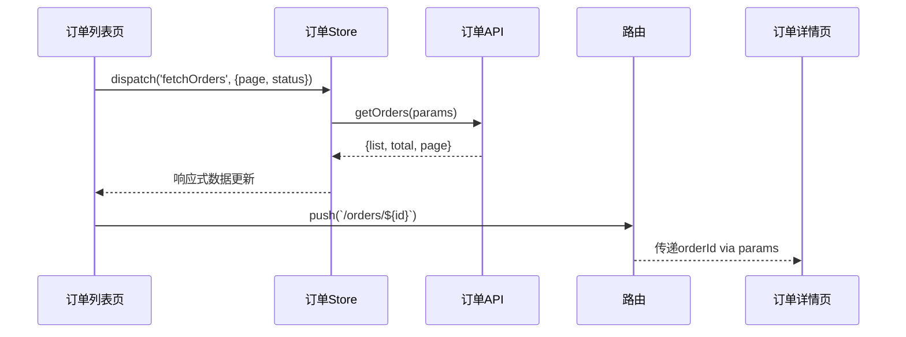

# Coral 前端全流程协作开发技能

## 续接机制（每次启动时最先执行）

**本技能采用 CronCreate 定时调度模式：每个阶段完成后清空上下文，通过定时任务自动触发下一阶段，无需用户手动介入。**

### 执行流程

每次技能触发时，首先检查是否存在进行中的工作流：

**检查步骤：**
1. 扫描 `docs/workflow/` 下所有子目录，查找包含 `progress.json` 的目录
2. 兼容旧版：如果 `docs/workflow/progress.json` 直接存在于 workflow 根目录（非子目录中），将其迁移到 `docs/workflow/legacy/` 下，然后进入续接模式
3. 根据扫描结果决定后续行为：

**如果找到1个进行中的任务（续接模式）：**
1. 从目录名提取 `<task-slug>`
2. 读取 `docs/workflow/<task-slug>/progress.json` 获取当前阶段和进度
3. 读取 `docs/workflow/<task-slug>/progress.md` 获取详细上下文
4. 读取 memory 文件获取关键决策索引
5. 检查 `restart_count` 和 `last_validation` 字段：
   - 如果 `last_validation` 为 "未通过"，输出："检测到上轮验证未通过，正在重新梳理需求..."
   - 输出续接信息："继续执行阶段 [N]：[阶段名称]（第 [X] 次重启）"
6. 从断点阶段开始执行，跳过所有已完成的阶段
7. 读取 `docs/workflow/<task-slug>/final-validation-report.md`（如果存在）获取上轮验证的问题列表
8. 读取 `docs/workflow/<task-slug>/restart-history.md`（如果存在）获取历史重启记录

**如果找到多个进行中的任务：**
1. 列出所有进行中的任务及其阶段信息
2. 使用 AskUserQuestion 让用户选择要续接的任务，或选择开始新任务
3. 根据用户选择进入续接模式或新项目模式

**如果没有找到进行中的任务（新项目模式）：**
1. 进入 阶段0：项目模式识别 + 原始需求捕获
2. 生成任务 slug 并创建 `docs/workflow/<task-slug>/` 目录结构
3. 初始化空的 `progress.json` 和 `progress.md`

### 自动续接机制（核心 — CronCreate 调度 + /clear 清空上下文）

**为什么需要清空上下文**：整个工作流跨越10个阶段，单次会话上下文会不断膨胀。清空上下文后每个阶段从文件恢复状态，确保：
- 上下文窗口不被前序阶段占用，每个阶段有充足空间
- 避免长上下文导致的遗忘或混淆
- 每个阶段从文件读取完整上下文，确保信息准确

**每个阶段完成后，自动执行以下操作：**

1. **保存状态** — 将当前阶段的所有状态保存到：
   - `docs/workflow/<task-slug>/progress.json`（结构化数据）
   - `docs/workflow/<task-slug>/progress.md`（人类可读）
   - `memory/<task-slug>-phase-{N}-completed.md`（关键决策索引）

2. **输出过渡信息 + 提示清空上下文** — 告知用户当前阶段已完成，提示输入 /clear：
   ```
   ─────────────────────
   阶段 [N] 已完成：[阶段名称]
   [关键产出摘要]
   → 阶段 [N+1]：[阶段名称] 将在约1分钟后自动开始
💡 请输入 /clear 清空上下文
   💡 请输入 /clear 清空上下文，下一阶段会自动触发
   ─────────────────────
   ```

3. **创建 CronCreate 定时任务（durable: true）** — 调度下一阶段自动执行。使用 durable: true 确保定时任务在 /clear 后仍然存活：

   **步骤 3a：获取1分钟后的时间（cron 格式）**
   ```bash
   date -d '+1 minute' '+%M %H %d %m' 2>/dev/null || python -c "from datetime import datetime,timedelta;t=datetime.now()+timedelta(minutes=1);print(t.strftime('%M %H %d %m'))"
   ```

   **步骤 3b：使用获取的时间创建一次性 CronCreate（必须 durable: true）**
   ```
   CronCreate({
     cron: "[minute] [hour] [day] [month] *",
     recurring: false,
     durable: true,
     prompt: "继续执行工作流。读取 docs/workflow/ 下的进度文件，使用 /coral-workflow 技能从上次完成的阶段继续执行。"
   })
   ```

4. **结束当前回合** — 创建 CronCreate 后，不要再执行任何操作，让当前回合自然结束。

**用户的操作**：每个阶段完成后，只需输入 `/clear` 即可。durable 定时任务会在 /clear 后自动触发下一阶段，不需要再输入任何指令。

**为什么必须 durable: true**：`/clear` 会清空会话上下文，session-only 的 CronCreate 任务会随之消失。durable: true 将任务持久化到 `.claude/scheduled_tasks.json`，即使 /clear 后也能存活并自动触发。

### 工作流重启机制

**当阶段9验证未通过时，通过 CronCreate 调度重启：**

1. **保存验证结果和重启信息** — 更新 progress.json 和 restart-history.md

2. **创建 CronCreate 定时任务（durable: true）** — 与正常阶段过渡相同的流程，但 prompt 指向从阶段1重新开始：
   ```
   CronCreate({
     cron: "[minute] [hour] [day] [month] *",
     recurring: false,
     durable: true,
     prompt: "工作流验证未通过，需要重启。读取 docs/workflow/ 下的进度文件和验证报告，使用 /coral-workflow 技能从阶段1重新梳理需求。重点关注验证报告中的问题。"
   })
   ```

3. **重启限制** — 最多允许重启3次，超过后停止自动重启，使用 AskUserQuestion 请求用户决策

4. **重启记录** — 每次重启时更新 `docs/workflow/<task-slug>/restart-history.md`

### 整体流转（/clear + CronCreate 自动续接）

每个阶段完成后的操作流程：

```
阶段N完成
  ↓
保存状态到文件
  ↓
创建 CronCreate (durable: true, ~1分钟后触发)
  ↓
输出过渡信息 + 提示 "请输入 /clear"
  ↓
用户输入 /clear → 上下文清空
  ↓
CronCreate 定时触发 → /coral-workflow 自动执行
  ↓
技能从文件读取上下文 → 开始阶段N+1
  ↓
... 重复直到阶段9验证通过
```

**用户每阶段只需做一件事：输入 `/clear`。** 后续的技能触发和阶段执行全部自动完成。

**用户需要额外介入的时机**（工作流本身的问答，非系统中断）：
- 阶段1需求澄清时的问答
- 阶段2设计偏好调研和方案选定
- 阶段3疑问确认
- 阶段3技术方案选型
- 重启达到上限时的用户决策

**如果忘记输入 /clear**：CronCreate 仍会自动触发，但旧上下文未清空，下一阶段在已有上下文中执行。不影响功能，但上下文不会清空。

**如果 CronCreate 定时任务未能触发**（如会话意外关闭）：
- 进度文件已保存，不会丢失
- 用户只需重新输入 `/coral-workflow`，技能会自动从上次断点续接

---

## 核心原则

不急于写代码。先理清需求，再拆分任务，最后以测试用例为准驱动开发。任何阶段遇到疑问，必须先向用户确认，再继续推进。

本技能是 coral-frontend 的上游流程 — 完成从需求到开发规划的完整链路后，交接给 coral-frontend 执行实际编码。

---

## 工作流目录规范

**每个需求任务使用独立的文档目录**，避免不同任务的产出互相干扰。

目录格式：`docs/workflow/<task-slug>/`

- `<task-slug>` 是阶段0根据用户需求生成的短标识符（小写英文 + 连字符，如 `user-management`、`data-export`、`order-system`）
- slug 从用户需求的核心意图中提取，简短且能区分不同任务
- 同一任务的所有阶段产出都写入该目录下的文件

**示例目录结构：**
```
docs/workflow/
├── user-management/          ← 任务1
│   ├── progress.json
│   ├── original-request.md
│   ├── prd.md
│   └── ...
├── data-export/              ← 任务2
│   ├── progress.json
│   ├── original-request.md
│   └── ...
```

**所有文档路径均基于 `docs/workflow/<task-slug>/`**，本文档中出现的 `<task-slug>` 均指当前任务的 slug 值，该值保存在 `progress.json` 的 `task_slug` 字段中，续接时从中读取。

---

## 阶段总览

```
阶段0: 项目模式识别 + 原始需求捕获
  ├─ 0.1 识别项目模式（从0创建/已有项目迭代）
  └─ 0.2 捕获并保存用户原始需求（持久化存储，确保任何情况下都不会丢失）
  ↓
阶段1: 需求分析（产品经理视角）→ PRD + 原型
  ↓
阶段2: UI/UX 设计（设计师视角）→ 偏好调研 → 趋势调研 → 多方案HTML → 用户选定 → 模块设计稿
  ↓
阶段3: 逻辑梳理与技术方案（架构师视角）→ 流程图 + 交互时序图 + 集成契约 + 技术选型
  ↓
阶段4: 测试用例编写（测试视角）→ 功能用例 + 集成用例 + 端到端用例
  ↓
阶段5: 任务拆分与分配（项目经理视角）→ 共享接口先行 + 并行任务 + 集成拼装收尾
  ↓
阶段6: 开发执行（交接 coral-frontend）
  6.1 共享接口定义（T-001，最先执行）
  6.2 并行开发（多个 Agent 并行，每个任务含控制台验证）
  6.3 集成拼装 + 冒烟测试（最后执行）
  6.4 样式验证（布局/对齐/间距/颜色/字体/交互）
  6.5 控制台验证（全页面扫描，零错误零警告）
  ↓
阶段7: 功能测试（测试工程师视角）→ 端到端优先 → 集成 → 功能
  ↓
阶段8: 回归测试与交付（项目经理视角）→ 整体验收
  ↓
阶段9: 最终验证（产品经理Agent）→ 对照原始需求验证，确保完全符合用户意图
  ├─ 验证通过 → [WORKFLOW_COMPLETE] 真正完成
  └─ 验证未通过 → 重新从阶段1开始梳理，直到验证通过为止
```

每个阶段完成时，将进度写入 `docs/workflow/<task-slug>/progress.json`（结构化）和 `docs/workflow/<task-slug>/progress.md`（可读），并在 memory 中记录关键状态，实现双保险上下文管理。

---

## 阶段 0：项目模式识别 + 原始需求捕获

本阶段有三个核心任务：生成任务标识、识别项目模式，以及捕获并持久化保存用户的原始需求。

### 0.0 任务标识生成

**为什么需要任务标识：** 每个需求任务必须有独立的工作目录，避免不同任务的产出互相干扰。任务 slug 决定了所有文档的存放路径。

**执行步骤：**

1. **分析用户需求的核心意图**，从中提取一个简短的英文标识符
2. **slug 格式要求：** 小写字母 + 连字符，2-4个单词，能区分不同任务
3. **slug 生成规则：** 从需求的核心业务对象或功能模块中提取

**示例：**
- "帮我实现用户管理模块" → `user-management`
- "开发数据导出功能" → `data-export`
- "做一个订单系统" → `order-system`
- "给已有项目添加权限控制" → `permission-control`

4. **检查 slug 是否已存在：** 如果 `docs/workflow/<task-slug>/` 目录已存在，在 slug 后追加数字（如 `user-management-2`）
5. **创建目录：** `docs/workflow/<task-slug>/`
6. **将 slug 保存到所有后续文件路径中**，progress.json 中必须包含 `task_slug` 字段

### 0.1 项目模式识别

判断当前项目属于哪种模式，后续所有流程据此调整：

**模式 A — 从0创建项目：** 无现有代码库。需额外产出：技术选型方案、项目脚手架、规范文档。

**模式 B — 已有项目迭代：** 存在运行中的代码库。需额外产出：当前项目规范文档（编码规范、目录结构、组件规范、接口规范、UI风格指南），读取 `references/project-spec.md`（如果存在）。

**执行：** 使用 AskUserQuestion 确认项目模式。若为模式B，先分析现有项目代码结构生成规范文档，存入 `docs/workflow/<task-slug>/project-spec.md`。

### 0.2 原始需求捕获（关键步骤）

**为什么需要原始需求捕获**：
- 整个流程会经历多个阶段，需要持久化存储确保进度不丢失
- 开发过程中可能发生需求理解偏差
- 最终必须验证已完成功能是否符合用户最初的真实意图
- 只有验证通过才算真正完成，否则需要重新从阶段1开始

**执行步骤**：

1. **捕获用户原始输入**
   - 记录用户最初的完整需求描述
   - 记录用户的期望和约束条件
   - 记录用户提到的任何偏好、参考、目标等

2. **保存到持久化文件**
   创建 `docs/workflow/<task-slug>/original-request.md`，格式如下：

   ```markdown
   # 用户原始需求

   ## 原始输入（原文）
   [完整记录用户最初的输入，不做任何修改或总结]

   ## 捕获时间
   [ISO-8601 时间戳]

   ## 上下文信息
   - 项目模式：[模式A/模式B]
   - 是否为重启流程：[是/否]
   - 重启次数：[当前是第几次重新开始]

   ## 核心意图提取
   - 业务目标：
   - 核心场景：
   - 关键约束：
   - 期望成果：

   ## 验证要点（用于阶段9验证）
   1. [核心功能点1]
   2. [核心功能点2]
   3. [核心功能点3]
   ...
   ```

3. **保存 JSON 格式**（便于 AI 读取）
   创建 `docs/workflow/<task-slug>/original-request.json`：

   ```json
   {
     "original_input": "用户原始输入原文",
     "captured_at": "ISO-8601 时间戳",
     "project_mode": "A/B",
     "is_restart": false,
     "restart_count": 0,
     "core_intents": {
       "business_goal": "业务目标",
       "core_scenarios": ["核心场景1", "核心场景2"],
       "key_constraints": ["约束1", "约束2"],
       "expected_outcomes": ["期望1", "期望2"]
     },
     "validation_checkpoints": [
       "验证要点1",
       "验证要点2",
       "验证要点3"
     ]
   }
   ```

4. **保存到 memory**
   创建 `memory/<task-slug>-original-request.md`，作为备份，确保即使 docs 目录被删除也能恢复原始需求。

**重要原则**：
- 原始需求一经保存，**绝不允许修改**
- 如果需求变更，创建新的版本而不是修改原文件
- 阶段9的验证始终以原始需求为准，确保最终交付符合用户最初的真实意图

### 阶段完成检查点

**本阶段完成后，执行以下检查点操作：**

1. **保存进度到 progress.json：**
```json
{
  "task_slug": "user-management",
  "current_phase": 0,
  "phase_name": "项目模式识别与原始需求捕获",
  "status": "completed",
  "project_mode": "A/B",
  "original_request_captured": true,
  "restart_count": 0,
  "output_files": [
    "docs/workflow/<task-slug>/project-spec.md",
    "docs/workflow/<task-slug>/original-request.md",
    "docs/workflow/<task-slug>/original-request.json"
  ],
  "next_phase": 1
}
```

2. **保存进度到 progress.md：**
```markdown
# 工作流进度

## 阶段 0：项目模式识别与原始需求捕获 ✅

**状态**：已完成
**项目模式**：[模式A/模式B]
**原始需求已捕获**：是
**捕获时间**：[时间戳]

### 产出文件
- `docs/workflow/<task-slug>/project-spec.md`
- `docs/workflow/<task-slug>/original-request.md` - 用户原始需求（不可修改）
- `docs/workflow/<task-slug>/original-request.json` - 原始需求结构化数据

### 下一阶段
阶段 1：需求分析（产品经理视角）
```

3. **保存到 memory：**
创建 `memory/<task-slug>-phase-0-completed.md`，记录项目模式决策和原始需求摘要。

4. **调度阶段1自动执行** — 输出过渡信息，然后创建 CronCreate 定时任务：
```
─────────────────────
阶段 0 已完成：项目模式识别与原始需求捕获
项目模式：[模式A/模式B]
原始需求已保存到 docs/workflow/<task-slug>/original-request.md
→ 阶段 1：需求分析（产品经理视角）将在约1分钟后自动开始
💡 请输入 /clear 清空上下文
─────────────────────
```
按照「自动续接机制」创建 CronCreate 定时任务，调度阶段1执行。


---

## 阶段 1：需求分析（产品经理视角）

### 1.1 需求澄清

以产品经理身份向用户提问，每次不超过5个问题，等用户回答后再追问下一批。澄清维度：

- 业务目标：解决什么问题？面向什么用户？
- 核心场景：主要使用场景？优先级？
- 边界条件：异常场景怎么处理？
- 数据流向：数据从哪来？到哪去？权限？
- 交互偏好：有没有参考产品？风格偏好？
- 交付约束：截止时间？依赖的外部系统？

不假设答案，不跳过疑问。

### 1.2 产出 PRD 文档

需求澄清完成后，生成结构化 PRD。模板见 `references/prd-template.md`，保存到 `docs/workflow/<task-slug>/prd.md` + `docs/workflow/<task-slug>/prd.json`。

### 1.3 产出原型图

根据 PRD 生成 HTML 原型预览页面：
- 低保真线框图级别
- 覆盖核心页面和关键交互流程
- 标注页面跳转关系
- 模式B需标注与现有页面的关联

保存到 `docs/workflow/<task-slug>/prototype/index.html`。

### 阶段完成检查点

**本阶段完成后，执行以下检查点操作：**

1. **保存进度到 progress.json：**
```json
{
  "current_phase": 1,
  "phase_name": "需求分析",
  "status": "completed",
  "output_files": [
    "docs/workflow/<task-slug>/prd.md",
    "docs/workflow/<task-slug>/prd.json",
    "docs/workflow/<task-slug>/prototype/index.html"
  ],
  "next_phase": 2
}
```

2. **保存进度到 progress.md：** 追加阶段 1 完成记录。

3. **保存到 memory：**
创建 `memory/<task-slug>-phase-1-completed.md`，记录核心需求和关键决策。

4. **调度阶段2自动执行** — 输出过渡信息，然后创建 CronCreate 定时任务：
```
─────────────────────
阶段 1 已完成：需求分析（产品经理视角）
产出：PRD + 原型
→ 阶段 2：UI/UX设计（设计师视角）将在约1分钟后自动开始
💡 请输入 /clear 清空上下文
─────────────────────
```
按照「自动续接机制」创建 CronCreate 定时任务，调度阶段2执行。


---

## 阶段 2：UI/UX 设计（设计师视角）

本阶段分四步走：偏好调研 → 方案探索 → 用户选定 → 详细设计稿。不直接出设计，先了解用户要什么、行业在做什么，再动手。

### 2.1 设计偏好调研

以设计师身份向用户提问，了解设计方向，每次不超过5个问题：

```
- 风格偏好：简约专业 / 活泼年轻 / 沉稳大气 / 其他？
- 参考产品：有没有觉得设计好的产品？（给名字或截图路径）
- 色彩倾向：主色偏好？冷色/暖色/中性？品牌色？
- 目标用户群审美：用户是年轻人/中年/企业用户？不同群体对视觉的期望不同
- 情绪关键词：希望用户看到产品时的第一感受？（高效、安心、愉悦、专业...）
- 竞品设计：有没有觉得设计不好的竞品？哪里不好？
```

**模式B额外询问：**
- 对现有系统UI的满意度？哪些地方觉得丑/不统一？
- 新功能是要融入现有风格，还是可以建立独立视觉分区？

### 2.2 设计趋势调研

根据用户偏好和项目类型，使用 WebSearch 工具搜索当下相关领域的优秀设计实践：

```
搜索维度：
- "{项目类型} UI design trends 2026" — 当下主流设计趋势
- "{功能类型} best UI examples" — 同类功能的优秀设计案例
- "{风格关键词} dashboard/admin/landing page design" — 对应风格的设计参考
- "{参考产品名} design system" — 用户提到的参考产品的设计体系
```

调研结果整理为简报，保存到 `docs/workflow/<task-slug>/design-research.md`：
- 3-5个优秀设计案例的截图/链接和亮点分析
- 当前趋势总结（如：大圆角、玻璃态、渐变、微交互等哪些适合本项目）
- 与用户偏好的匹配分析

### 2.3 多方案设计探索

基于用户偏好 + 行业调研，产出 **2-3个不同方向**的设计方案，每个方案以 HTML 页面呈现，保存到 `docs/workflow/<task-slug>/design-options/`：

```
docs/workflow/<task-slug>/design-options/
├── option-A.html    # 方案A（如：简约专业风）
├── option-B.html    # 方案B（如：活力年轻风）
└── option-C.html    # 方案C（如：沉稳商务风）
```

每个 HTML 方案必须包含：

**视觉风格板（Mood Board）：**
- 主色 / 辅色 / 功能色（成功/警告/错误） / 中性色
- 字体：标题字体 + 正文字体，含字重和字号层级
- 间距体系（4px/8px/12px/16px/24px/32px）
- 圆角规范（小组件/卡片/弹窗）
- 阴影层级
- 按钮样式（主要/次要/文字按钮，含hover/active/disabled状态）

**典型页面预览：**
- 1-2个核心页面的高保真 HTML 渲染
- 展示该方案下的真实视觉效果

**方案说明：**
- 风格定位一句话描述
- 适合的用户群和场景
- 与竞品的差异化
- 优势与局限

**模式B约束：** 如果是已有项目迭代，方案C可以是"延续现有风格"的选项，方便用户在"保持一致"和"焕新升级"之间选择。

### 2.4 用户选定

将2-3个方案呈现给用户选择。使用 AskUserQuestion 让用户：
- 选定一个方向
- 也可以混搭：从方案A取配色，从方案B取布局，从方案C取交互风格
- 补充修改意见

用户选定后，记录选择结果和修改意见到 `docs/workflow/<task-slug>/design-decision.md` + `design-decision.json`。

### 2.5 详细设计稿产出

基于用户选定的方案，逐模块产出详细 HTML 设计稿。每个功能模块一个独立 HTML 文件：

```
docs/workflow/<task-slug>/design-specs/
├── module-attendance.html    # 考勤管理模块
├── module-leave.html         # 请假管理模块
├── module-overtime.html      # 加班管理模块
├── module-report.html        # 统计报表模块
└── shared-components.html    # 共享组件库
```

**每个模块的 HTML 设计稿必须包含：**

**A. 完整页面布局**
- 页面的每一个区域都必须渲染出来，不能有占位符或"此处省略"
- 包含导航栏、侧边栏、内容区、弹窗、抽屉等所有可见区域

**B. 全部交互状态标注**
每个交互元素必须标注以下所有状态，不能有遗漏：

| 元素类型 | 必须标注的状态 |
|---------|--------------|
| 按钮 | 默认 / hover / active / disabled / loading |
| 输入框 | 默认 / focus / 有值 / 错误 / disabled |
| 下拉选择 | 默认 / 展开 / 选中项 / 搜索中 / 无结果 |
| 表格 | 默认 / 空状态 / 加载中 / 排序 / 筛选中 / 分页 |
| 弹窗/抽屉 | 打开 / 关闭 / 确认中 / 提交成功 / 提交失败 |
| 列表项 | 默认 / hover / 选中 / 操作按钮显隐规则 |
| 标签页 | 默认 / 选中 / hover |
| 开关/复选 | 开 / 关 / 禁用 |
| 提示消息 | 成功 / 警告 / 错误 / 信息 |
| 加载状态 | 骨架屏 / spinner / 进度条 |

**C. 交互行为注解（以 HTML 注释或旁注形式）**
每个交互点必须用注解说明：
```html
<!-- 交互：点击"提交"按钮后
  1. 按钮变为 loading 状态，禁用重复点击
  2. 调用 POST /api/leave/apply 接口
  3. 成功：关闭弹窗 + 显示成功提示 + 刷新列表
  4. 失败：按钮恢复可点击 + 显示错误信息 + 保持弹窗不关闭
  5. 网络超时：按钮恢复可点击 + 显示"网络超时，请重试" -->
```

**D. 边界场景展示**
- 空数据状态（无记录、无搜索结果）
- 数据溢出处理（长文本截断、多标签折叠）
- 大数据量表现（表格滚动、虚拟列表）
- 权限控制展示（有权限 vs 无权限看到的差异）
- 移动端适配（如需要，标注断点行为）

**E. 动效说明**
- 页面切换动效（滑入/淡入/无）
- 弹窗出现/消失动效（缩放/滑入/淡入）
- 列表项操作反馈（滑出删除、拖拽排序）
- 加载状态过渡

**F. 共享组件库**
`shared-components.html` 包含所有跨模块复用的组件：
- 每个组件的所有状态变体
- Props 说明和可配置项
- 使用场景说明
- 与设计规范（色彩/字体/间距）的映射关系

**设计稿自检清单（产出前必须逐项确认）：**

- [ ] 每个页面是否都有完整的 HTML 渲染（无占位符）？
- [ ] 每个按钮/输入框/表格是否都标注了全部交互状态？
- [ ] 每个交互点是否都有行为注解（点击后会发生什么）？
- [ ] 空状态/错误状态/加载状态是否都有展示？
- [ ] 表单校验规则是否标注（哪些必填、格式要求、错误提示文案）？
- [ ] 弹窗/抽屉的打开和关闭条件是否明确？
- [ ] 页面跳转关系和传参方式是否标注？
- [ ] 一个不了解需求的开发人员能否仅凭设计稿完成全部功能？

**为什么要求这么多细节**：设计稿是开发人员的唯一视觉参照。如果设计稿有遗漏，开发人员要么自行脑补（导致与设计师意图不一致），要么反复询问（浪费沟通成本）。标注到"开发人员可以直接照着写代码"的粒度，才能确保最终实现与设计一致。

### 阶段完成检查点

**本阶段完成后，执行以下检查点操作：**

1. **保存进度到 progress.json：**
```json
{
  "current_phase": 2,
  "phase_name": "UI/UX设计",
  "status": "completed",
  "design_decision": "用户选定的方案",
  "output_files": [
    "docs/workflow/<task-slug>/design-options/",
    "docs/workflow/<task-slug>/design-decision.md",
    "docs/workflow/<task-slug>/design-specs/"
  ],
  "next_phase": 3
}
```

2. **保存进度到 progress.md：** 追加阶段 2 完成记录，记录选定的设计方向。

3. **保存到 memory：**
创建 `memory/<task-slug>-phase-2-completed.md`，记录设计决策和设计规范关键点。

4. **调度阶段3自动执行** — 输出过渡信息，然后创建 CronCreate 定时任务：
```
─────────────────────
阶段 2 已完成：UI/UX设计（设计师视角）
设计决策：[用户选定的方案]
→ 阶段 3：逻辑梳理与技术方案（架构师视角）将在约1分钟后自动开始
💡 请输入 /clear 清空上下文
─────────────────────
```
按照「自动续接机制」创建 CronCreate 定时任务，调度阶段3执行。


---

## 阶段 3：逻辑梳理与技术方案（架构师视角）

### 3.1 逻辑流程图

在写任何功能代码之前，先梳理：
- 用户操作流程图（入口到完成的完整路径）
- 数据流转图（各层数据流转）
- 状态流转图（核心业务对象的状态机）
- 异常流程图（异常分支处理路径）

使用 Mermaid 语法写入 `docs/workflow/<task-slug>/flow-diagrams.md`。

### 3.2 模块交互时序图

这是避免"各模块能跑但拼不起来"的关键产出。梳理模块间的调用关系：

- 哪个模块调用哪个模块的什么方法/事件？
- 调用时传什么参数？返回什么数据？
- 状态变更后如何通知其他模块？
- 页面跳转时如何传递上下文？

使用 Mermaid sequenceDiagram 语法，为每个跨模块交互场景画出时序图。每个交互都必须标注：调用方、接收方、方法名/事件名、参数结构、返回值。

示例：


### 3.3 集成契约定义

这是并行开发能成功拼装的核心。在拆分任务之前，必须先定义所有跨模块的接口契约，写入 `docs/workflow/<task-slug>/integration-contract.md` + `integration-contract.json`：

```markdown
# 集成契约

## API 接口契约
| 接口 | 方法 | 请求参数 | 响应结构 | 调用方 | 提供方 |
|------|------|---------|---------|--------|--------|
| /api/orders | GET | {page, status} | {list, total} | 订单列表 | 后端 |

## Store 事件契约
| Store | Action/Mutation | 参数 | 产生副作用 | 订阅方 |
|-------|----------------|------|-----------|--------|
| orderStore | fetchOrders | {page} | 更新orderList | 订单列表页 |

## 组件 Props/Emits 契约
| 组件 | Prop | 类型 | Emit | 载荷 |
|------|------|------|------|------|
| OrderCard | order | Order | @click | orderId |

## 路由跳转契约
| 来源页 | 目标页 | 传参方式 | 参数结构 |
|--------|--------|---------|---------|
| 列表页 | 详情页 | params | {id: string} |
```

**为什么这很重要**：并行开发时，每个开发者只看自己的任务，不知道其他模块期望什么接口。集成契约让所有开发者在开发前就知道"我需要提供什么"和"我可以依赖什么"，避免拼装时接口对不上。

### 3.4 疑问点清单

梳理中发现的疑问，必须列出并用 AskUserQuestion 向用户确认。未全部确认前不进入下一阶段。

保存到 `docs/workflow/<task-slug>/questions.md`，格式：

| 序号 | 疑问描述 | 影响范围 | 建议 | 用户确认结果 |
|------|---------|---------|------|------------|
| 1    | ...     | ...     | ...  | 待确认     |

### 3.5 技术方案选型

针对每个技术难点，提供2-3个可选方案供用户选择（含实现思路、优缺点、工期评估）。推荐方案并说明理由，让用户做最终选择。

保存到 `docs/workflow/<task-slug>/tech-solutions.md` + `docs/workflow/<task-slug>/tech-solutions.json`。

### 阶段完成检查点

**本阶段完成后，执行以下检查点操作：**

1. **保存进度到 progress.json：**
```json
{
  "current_phase": 3,
  "phase_name": "逻辑梳理与技术方案",
  "status": "completed",
  "output_files": [
    "docs/workflow/<task-slug>/flow-diagrams.md",
    "docs/workflow/<task-slug>/integration-contract.md",
    "docs/workflow/<task-slug>/integration-contract.json",
    "docs/workflow/<task-slug>/questions.md",
    "docs/workflow/<task-slug>/tech-solutions.md",
    "docs/workflow/<task-slug>/tech-solutions.json"
  ],
  "questions_resolved": true,
  "next_phase": 4
}
```

2. **保存进度到 progress.md：** 追加阶段 3 完成记录，记录技术选型决策。

3. **保存到 memory：**
创建 `memory/<task-slug>-phase-3-completed.md`，记录集成契约和关键技术决策。

4. **调度阶段4自动执行** — 输出过渡信息，然后创建 CronCreate 定时任务：
```
─────────────────────
阶段 3 已完成：逻辑梳理与技术方案（架构师视角）
集成契约已定义，技术方案已确认
→ 阶段 4：测试用例编写（测试视角）将在约1分钟后自动开始
💡 请输入 /clear 清空上下文
─────────────────────
```
按照「自动续接机制」创建 CronCreate 定时任务，调度阶段4执行。


---

## 阶段 4：测试用例编写（测试视角，开发前完成）

基于 PRD 和流程图编写完整测试用例。这是开发的验收标准 — 开发的目标是让所有测试用例通过。

模板见 `references/test-case-template.md`，保存到 `docs/workflow/<task-slug>/test-cases.md` + `docs/workflow/<task-slug>/test-cases.json`。

### 4.1 用例分类

测试用例分为三类，缺一不可：

**A. 功能用例（单模块）** — 验证单个功能点的正确性
- 正向流程、边界值、异常流程、交互细节

**B. 集成用例（跨模块）** — 验证模块间交互的正确性
- 模块A的操作是否正确触发模块B的响应
- 数据在模块间流转是否完整无损
- 状态变更是否正确通知相关模块
- 页面跳转时上下文是否正确传递

**C. 端到端用例（完整用户旅程）** — 验证从入口到出口的完整流程
- 从用户进入页面到完成操作的每一步都能走通
- 覆盖 PRD 中定义的每个核心用户场景
- 这是最重要的用例类别 — 如果端到端流程不通，整个功能就不可用

### 4.2 端到端用例编写要求

每个核心用户场景必须至少有一条端到端用例，格式：

```markdown
### E2E-{编号}：{用户场景名称}

- 用户角色：
- 完整操作路径：首页 → 列表 → 详情 → 提交 → 结果
- 前置条件：
- 测试步骤：
  1. 打开XX页面
  2. 点击XX按钮（触发模块A → 模块B的交互）
  3. 在XX表单填写数据
  4. 提交（触发模块B → 模块C的交互）
  5. 验证结果页显示
- 预期结果：每一步的页面状态和数据变化
- 涉及模块：模块A、模块B、模块C
- 优先级：P0（端到端用例默认为P0）
```

**为什么端到端用例是P0**：单个功能点通过测试不能保证整体流程可用。端到端用例是最终交付的唯一真实验收标准。

### 4.3 用例属性

每条用例包含：编号、标题、前置条件、测试步骤、预期结果、优先级（P0/P1/P2）、所属类别（功能/集成/端到端）、所属模块、测试结果（未执行/通过/未通过）、关联Bug编号。

### 阶段完成检查点

**本阶段完成后，执行以下检查点操作：**

1. **保存进度到 progress.json：**
```json
{
  "current_phase": 4,
  "phase_name": "测试用例编写",
  "status": "completed",
  "test_case_stats": {
    "total": 0,
    "functional": 0,
    "integration": 0,
    "e2e": 0
  },
  "output_files": [
    "docs/workflow/<task-slug>/test-cases.md",
    "docs/workflow/<task-slug>/test-cases.json"
  ],
  "next_phase": 5
}
```

2. **保存进度到 progress.md：** 追加阶段 4 完成记录，统计用例数量。

3. **保存到 memory：**
创建 `memory/<task-slug>-phase-4-completed.md`，记录测试用例概览和关键验收标准。

4. **调度阶段5自动执行** — 输出过渡信息，然后创建 CronCreate 定时任务：
```
─────────────────────
阶段 4 已完成：测试用例编写（测试视角）
用例统计：功能[X]条、集成[X]条、端到端[X]条
→ 阶段 5：任务拆分与分配（项目经理视角）将在约1分钟后自动开始
💡 请输入 /clear 清空上下文
─────────────────────
```
按照「自动续接机制」创建 CronCreate 定时任务，调度阶段5执行。


---

## 阶段 5：任务拆分与分配（项目经理视角）

### 5.1 拆分原则

以**多开发者可并行、无代码冲突**为最高原则：
- 每个任务边界清晰，涉及的文件/模块不与其他并行任务重叠
- 共享依赖（公共组件、接口定义）作为独立前置任务优先完成
- 每个任务可独立开发、独立验证
- 任务粒度：单个任务不超过2天工作量

### 5.2 强制任务：共享接口先行 + 集成拼装收尾

为了确保并行开发后能成功拼装，必须包含以下两个强制任务：

**T-001 共享接口定义（必须是最先执行的任务）**
- 根据阶段3产出的集成契约，创建所有跨模块共享的接口文件
- 内容包括：API 函数签名、Store 的 action/mutation 签名、TypeScript 类型定义、组件 props/emits 类型、路由配置
- 只写接口签名和类型定义，不写实现
- 所有并行开发任务依赖此任务完成后才能开始
- 保存到项目的对应目录（如 `src/api/`、`src/types/`、`src/stores/` 等）

**T-最后 集成拼装（必须是最后执行的任务）**
- 所有并行开发任务完成后执行
- 将各模块按集成契约接线拼装
- 执行所有端到端用例进行冒烟测试
- 修复集成问题（接口参数对不上、事件没触发、状态没同步等）
- 只有集成拼装通过后，才进入阶段7正式测试

**为什么需要这两个任务**：没有共享接口先行，各开发者会各自定义类型和接口，拼装时必定冲突。没有集成拼装收尾，各模块的"接缝"处永远没人检查，直到用户发现流程不通。

### 5.3 产出任务分配总表

### 5.2 产出任务分配总表

模板见 `references/task-assignment-template.md`，保存到 `docs/workflow/<task-slug>/task-assignment.md` + `docs/workflow/<task-slug>/task-assignment.json`。

每条任务包含：任务ID、名称、具体描述、开发实现细节、指派开发者、前置依赖、进度状态（待办/进行中/完成）、开始时间、完成时间。

### 5.4 依赖拓扑

明确标注任务间的先后依赖，形成可并行执行的拓扑图，用 Mermaid 语法写入任务分配文档。

### 阶段完成检查点

**本阶段完成后，执行以下检查点操作：**

1. **保存进度到 progress.json：**
```json
{
  "current_phase": 5,
  "phase_name": "任务拆分与分配",
  "status": "completed",
  "task_stats": {
    "total": 0,
    "pending": 0,
    "in_progress": 0,
    "completed": 0
  },
  "output_files": [
    "docs/workflow/<task-slug>/task-assignment.md",
    "docs/workflow/<task-slug>/task-assignment.json"
  ],
  "next_phase": 6
}
```

2. **保存进度到 progress.md：** 追加阶段 5 完成记录，列出任务概览。

3. **保存到 memory：**
创建 `memory/<task-slug>-phase-5-completed.md`，记录任务分配概览和依赖关系。

4. **调度阶段6自动执行** — 输出过渡信息，然后创建 CronCreate 定时任务：
```
─────────────────────
阶段 5 已完成：任务拆分与分配（项目经理视角）
任务拆分完成（共[X]个任务）
→ 阶段 6：开发执行（交接 coral-frontend）将在约1分钟后自动开始
💡 请输入 /clear 清空上下文
─────────────────────
```
按照「自动续接机制」创建 CronCreate 定时任务，调度阶段6执行。


---

## 阶段 6：开发执行

### 6.1 交接 coral-frontend

本阶段开始，将以下产出交接给 `coral-frontend` 技能执行实际编码：

- `docs/workflow/<task-slug>/prd.json` — 需求文档
- `docs/workflow/<task-slug>/design-spec.json` — 设计规范
- `docs/workflow/<task-slug>/flow-diagrams.md` — 逻辑流程
- `docs/workflow/<task-slug>/integration-contract.json` — 集成契约（新增，确保接口一致）
- `docs/workflow/<task-slug>/tech-solutions.json` — 技术方案
- `docs/workflow/<task-slug>/test-cases.json` — 测试用例
- `docs/workflow/<task-slug>/task-assignment.json` — 任务分配表

调用 `coral-frontend` 技能时，将任务分配表中的任务逐个传入。coral-frontend 负责实际的代码实现、质量检测和风格检测。每个开发者 Agent 的 prompt 中必须包含集成契约，确保开发时遵守接口规范。

### 6.2 Subagent 并行开发

**重要前提：每个 Agent 是独立的 session**

- 每个 Agent 有**独立的上下文窗口**，无法看到主会话的上下文
- Agent 之间的所有通信必须通过**文件系统**传递
- Agent 启动时必须从文件读取所需的全部上下文
- Agent 完成后必须将结果写入文件供其他 Agent 读取

**上下文传递机制：**

在启动 Agent 之前，主会话必须准备以下文件供 Agent 读取：
```
docs/workflow/<task-slug>/
├── agent-context/                 # Agent 上下文目录（每个 Agent 一份）
│   ├── developer-A.json         # 开发者A的专属上下文
│   ├── developer-B.json         # 开发者B的专属上下文
│   └── ...
├── agent-heartbeat/              # Agent 心跳文件（用于检测卡死）
│   ├── developer-A.heartbeat     # 开发者A的心跳文件
│   ├── developer-B.heartbeat     # 开发者B的心跳文件
│   └── ...
├── prd.json                      # PRD（所有 Agent 共享）
├── integration-contract.json     # 集成契约（所有 Agent 共享）
├── tech-solutions.json           # 技术方案（所有 Agent 共享）
└── task-assignment.json          # 任务分配表（所有 Agent 共享）
```

**Agent 启动流程：**

1. **准备 Agent 上下文文件**（主会话执行）：
```json
// docs/workflow/<task-slug>/agent-context/developer-A.json
{
  "agent_name": "developer-A",
  "agent_role": "开发者",
  "assigned_tasks": ["T-002", "T-005"],
  "integration_contract_path": "docs/workflow/<task-slug>/integration-contract.json",
  "prd_path": "docs/workflow/<task-slug>/prd.json",
  "tech_solutions_path": "docs/workflow/<task-slug>/tech-solutions.json",
  "progress_file": "docs/workflow/<task-slug>/task-assignment.json",
  "heartbeat_file": "docs/workflow/<task-slug>/agent-heartbeat/developer-A.heartbeat",
  "timeout_minutes": 30
}
```

2. **启动 Agent**：
```
Agent({
  subagent_type: "general-purpose",
  name: "developer-A",
  prompt: "你是开发者A。请严格按照以下步骤执行：

步骤1：读取你的上下文文件
  读取 docs/workflow/<task-slug>/agent-context/developer-A.json，获取你的任务、契约和配置。

步骤2：启动心跳机制
  每隔5分钟更新一次心跳文件 docs/workflow/<task-slug>/agent-heartbeat/developer-A.heartbeat，
  写入当前时间戳和正在执行的任务ID。格式：{"heartbeat_at": "ISO-8601", "current_task": "T-002"}

步骤3：读取共享上下文
  读取 docs/workflow/<task-slug>/integration-contract.json 中的接口契约
  读取 docs/workflow/<task-slug>/prd.json 了解需求
  读取 docs/workflow/<task-slug>/tech-solutions.json 了解技术方案
  读取 docs/workflow/<task-slug>/design-specs/ 中的设计稿

步骤4：逐个执行任务（每个任务完成后必须测试）
  对你的每个任务（如 T-002, T-005），按以下子流程执行：
  
  子流程：执行单个任务
  
  4.1 调用 /coral-frontend 技能实现任务代码
  
  4.2 更新心跳，标记当前任务
      写入 {"heartbeat_at": "ISO-8601", "current_task": "T-002", "sub_status": "testing"}
  
  4.3 编写并运行 Playwright 单元测试
      - 为该任务编写 Playwright 测试用例
      - 测试文件位置：tests/unit/[task-name].spec.ts
      - 运行测试：npm run test:unit -- [task-name].spec.ts
      - 检查测试结果
  
  4.4 使用 Playwright 进行样式验证
      - 启动开发服务器：npm run dev
      - 访问该任务相关的页面/组件
      - 使用 Playwright 检查样式问题：
        * 元素位置和尺寸
        * 颜色和对比度
        * 字体样式
        * 间距和对齐
        * 交互状态（hover/active/disabled）
      - 截图保存到 tests/screenshots/[task-name]/

  4.5 浏览器控制台验证（每个任务必须执行）
      使用 Playwright 捕获浏览器控制台输出，确保零错误零警告：
      - 在访问页面之前，先注册控制台消息监听：
        ```javascript
        const consoleMessages = [];
        page.on('console', msg => {
          consoleMessages.push({ type: msg.type(), text: msg.text() });
        });
        page.on('pageerror', error => {
          consoleMessages.push({ type: 'pageerror', text: error.message });
        });
        ```
      - 执行该任务涉及的核心用户操作（点击、输入、导航等）
      - 操作完成后检查 consoleMessages：
        * 如果有 type 为 "error" 或 "pageerror" 的消息 → 必须修复
        * 如果有 type 为 "warning" 的消息 → 必须修复
        * 忽略第三方库内部的控制台消息（判断依据：消息堆栈指向 node_modules）
      - 如果发现控制台错误或警告：
        a. 分析错误/警告来源和原因
        b. 修复代码问题
        c. 重新运行控制台验证
        d. 循环直到控制台零错误零警告
      - 将控制台验证结果记录到任务测试结果中

      为什么控制台验证必须在每个任务后执行：控制台错误和警告往往是功能缺陷的早期信号。一个未捕获的 warning 可能在后续集成时变成 error，一个被吞掉的 error 可能导致数据状态不一致。尽早发现并修复，成本远低于集成后排查。

  4.6 检查测试、样式和控制台验证结果
      如果有任何测试失败、样式问题或控制台错误/警告：
        - 分析失败原因
        - 修复代码问题
        - 重新运行测试、样式验证和控制台验证
        - 循环直到所有测试通过、所有样式问题修复、控制台零错误零警告

  4.7 记录任务完成
      - 更新任务状态为"completed"
      - 写入完成时间
      - 将测试结果、样式验证结果和控制台验证结果记录到 docs/workflow/<task-slug>/agent-test-results/developer-A/[task-id].json

  4.8 更新心跳
      写入 {"heartbeat_at": "ISO-8601", "current_task": "T-002", "sub_status": "completed"}

步骤5：所有任务完成后更新全局进度
  更新 docs/workflow/<task-slug>/task-assignment.json 中所有任务的状态为"completed"

步骤6：停止心跳
  在心跳文件中写入 {"status": "completed", "completed_at": "ISO-8601"}

重要提醒：
- 你是独立 session，只能通过文件获取上下文
- 必须严格遵守集成契约中的接口定义
- 每个任务完成后必须通过 Playwright 测试、样式验证和控制台验证才能进入下一个任务
- 测试失败、样式有问题或控制台有错误/警告时必须修复，不能跳过
- 如果遇到无法解决的问题，写入 docs/workflow/<task-slug>/agent-issues/developer-A.json"
})
```

**每个任务的测试、样式和控制台验证循环：**

```
任务开始
  ↓
实现代码
  ↓
运行 Playwright 单元测试
  ↓
┌─ 测试通过？ ──否→ 修复代码 ────┐
│    ↓是                         │
│ 样式验证                     │
│    ↓                         │
┌─ 样式OK？ ────否→ 修复样式 ──┤
│    ↓是                        │
│ 控制台验证                   │
│    ↓                         │
┌─ 控制台零错误零警告？ ──否→ 修复代码 ──┐
│    ↓是                                │
│ 记录任务完成                          │
└───────────────────────────────────────┘
  ↓
进入下一个任务
```

**Playwright 测试模板：**

每个任务的测试文件应包含：
```typescript
// tests/unit/[task-name].spec.ts
import { test, expect } from '@playwright/test';

test.describe('[Task-XXX] 任务名称', () => {
  test('功能正确性', async ({ page }) => {
    // 访问页面
    await page.goto('/path/to/page');
    
    // 测试核心功能
    await expect(page.locator('.element')).toBeVisible();
    await page.click('.button');
    await expect(page.locator('.result')).toHaveText('expected');
  });

  test('样式验证', async ({ page }) => {
    await page.goto('/path/to/page');
    
    // 验证元素存在
    const element = page.locator('.element');
    await expect(element).toBeVisible();
    
    // 验证颜色和对比度
    const styles = await element.evaluate(el => {
      const computed = window.getComputedStyle(el);
      return {
        color: computed.color,
        backgroundColor: computed.backgroundColor,
        fontSize: computed.fontSize,
        padding: computed.padding
      };
    });
    
    // 验证样式符合设计规范
    expect(styles.color).not.toBe('rgba(0, 0, 0, 0)');
    expect(styles.fontSize).toBeTruthy();
  });

  test('交互状态', async ({ page }) => {
    await page.goto('/path/to/page');

    const button = page.locator('.button');

    // 验证 hover 状态
    await button.hover();
    await expect(button).toHaveCSS('background-color', /hover-color/);

    // 验证 active 状态
    await button.click();
    await expect(button).toHaveCSS('transform', /scale/);
  });

  test('控制台零错误零警告', async ({ page }) => {
    const consoleMessages = [];
    page.on('console', msg => {
      consoleMessages.push({ type: msg.type(), text: msg.text() });
    });
    page.on('pageerror', error => {
      consoleMessages.push({ type: 'pageerror', text: error.message });
    });

    // 访问页面并执行核心操作
    await page.goto('/path/to/page');
    await page.click('.button');
    // ... 执行该任务涉及的其他操作

    // 等待异步操作完成
    await page.waitForTimeout(2000);

    // 过滤出自己代码产生的错误和警告（排除第三方库内部消息）
    const errors = consoleMessages.filter(msg =>
      (msg.type === 'error' || msg.type === 'pageerror') &&
      !msg.text.includes('node_modules')
    );
    const warnings = consoleMessages.filter(msg =>
      msg.type === 'warning' &&
      !msg.text.includes('node_modules')
    );

    expect(errors).toEqual([]);
    expect(warnings).toEqual([]);
  });
});
```

**样式验证检查清单（Agent 执行）：**

每个任务样式验证时，使用 Playwright 检查：
1. 元素可见性（toBeVisible）
2. 元素位置（boundingBox）
3. 元素尺寸（boundingBox）
4. 颜色值（evaluate 获取 computedStyle）
5. 字体样式（fontSize, fontFamily, fontWeight）
6. 间距（padding, margin）
7. 对齐（text-align, flexbox 布局）
8. 交互状态（hover, active, disabled）

**测试结果记录格式：**

```json
// docs/workflow/<task-slug>/agent-test-results/developer-A/T-002.json
{
  "task_id": "T-002",
  "task_name": "任务名称",
  "agent": "developer-A",
  "started_at": "ISO-8601",
  "completed_at": "ISO-8601",
  "unit_tests": {
    "total": 5,
    "passed": 5,
    "failed": 0,
    "test_file": "tests/unit/T-002.spec.ts"
  },
  "style_verification": {
    "issues_found": 0,
    "issues_fixed": 0,
    "screenshots": ["tests/screenshots/T-002/1.png"],
    "passed": true
  },
  "console_validation": {
    "errors": 0,
    "warnings": 0,
    "error_details": [],
    "warning_details": [],
    "passed": true
  },
  "retry_count": 0,
  "status": "completed"
}
```

3. **监控 Agent 心跳**（主会话执行）：
- 启动 Agent 后，每隔 2 分钟检查一次心跳文件
- 如果心跳文件超过 30 分钟未更新，判定为**卡死**
- 卡死处理：尝试重新启动该 Agent，最多重试 1 次
- 如果重试后仍卡死，标记任务为"failed"并记录到 docs/workflow/<task-slug>/agent-failures/

**并行策略：**
- 同一时刻可启动多个 Agent，每个代表一个开发者
- 每个 Agent 独立处理自己的任务集，不操作其他开发者的文件
- 共享依赖任务完成后，再启动依赖它的后续任务 Agent
- 每个 Agent 完成后更新 `task-assignment.json` 中的进度状态
- **每个 Agent 通过文件获取上下文，不依赖主会话的上下文窗口**

**Agent 卡死检测和恢复：**

心跳文件格式：
```json
// 正在执行时的心跳
{"heartbeat_at": "2026-05-08T10:30:00Z", "current_task": "T-002", "status": "running"}

// 完成时的心跳
{"status": "completed", "completed_at": "2026-05-08T10:45:00Z", "heartbeat_at": "2026-05-08T10:45:00Z"}

// 失败时的心跳
{"status": "failed", "failed_at": "2026-05-08T10:50:00Z", "error": "超时未响应", "heartbeat_at": "2026-05-08T10:20:00Z"}
```

卡死检测逻辑：
```
for each agent:
  last_heartbeat = 读取 heartbeat_file
  if (now - last_heartbeat.heartbeat_at) > timeout_minutes * 60:
    if (agent.retry_count < 1):
      agent.retry_count += 1
      重新启动 agent
    else:
      标记任务为 failed
      记录失败原因到 agent-failures/
```

**Agent 失败处理：**

如果 Agent 卡死且重试后仍失败：
1. 将相关任务状态标记为"failed"
2. 记录失败信息到 `docs/workflow/<task-slug>/agent-failures/{agent-name}.json`
3. 告知用户："Agent {agent-name} 执行失败，需要手动处理"
4. 暂停后续依赖任务，等待用户决策

### 6.3 集成拼装（所有并行开发完成后）

这是防止"各模块能跑但拼不起来"的关键步骤。所有并行开发任务完成后，执行集成拼装任务：

1. **检查接口一致性** — 逐项核对集成契约，确认每个模块的对外接口签名、参数、返回值与契约一致
2. **接线拼装** — 将各模块按集成契约连接：路由注册、Store 挂载、组件引用、事件绑定
3. **端到端冒烟测试** — 执行所有端到端用例，验证核心用户场景能走通
4. **修复集成问题** — 常见问题及修复方向：
   - 接口参数对不上 → 对照集成契约调整调用方或提供方
   - 事件没触发 → 检查 emit/on 是否配对、事件名是否一致
   - 状态没同步 → 检查 Store 的 action 是否正确 commit mutation
   - 页面跳转传参丢失 → 检查路由配置和 params/query 传递
5. **冒烟通过** — 所有端到端用例通过后，才能进入阶段7正式测试

### 6.4 样式验证（集成拼装通过后）

在进入正式功能测试之前，对已完成的页面进行视觉样式验证，确保没有一眼就能看出的问题。

#### 6.4.1 样式验证检查清单

**布局检查：**
- [ ] 元素没有重叠或错位
- [ ] 页面边距合理，内容不贴边
- [ ] 容器宽度/高度符合设计规范
- [ ] 滚动条出现在正确的位置
- [ ] 空白区域分布均匀，无明显断层

**对齐检查：**
- [ ] 文字对齐一致（左对齐/居中/右对齐）
- [ ] 图标与文字垂直居中对齐
- [ ] 按钮组水平对齐
- [ ] 表单元素标签与输入框对齐
- [ ] 卡片内容对齐一致

**间距检查：**
- [ ] padding/margin 符合设计规范（4px/8px/12px/16px/24px/32px）
- [ ] 同类元素间距一致（如列表项间距）
- [ ] 标题与内容间距合理
- [ ] 按钮与内容间距合理

**颜色检查：**
- [ ] 主色、辅色、功能色使用正确
- [ ] 文字与背景对比度足够（WCAG AA 标准）
- [ ] 禁用状态颜色正确
- [ ] 错误/警告/成功提示颜色正确
- [ ] 链接颜色与普通文字区分明显

**字体检查：**
- [ ] 字体统一（标题字体、正文字体）
- [ ] 字号层级清晰（H1/H2/H3/正文/小字）
- [ ] 行高合理（1.5-1.8 倍字号）
- [ ] 字重使用正确（常规/粗体）
- [ ] 没有中英文字号不一致的问题

**交互状态检查：**
- [ ] 按钮 hover/active/disabled 状态样式正确
- [ ] 输入框 focus/error/disabled 状态样式正确
- [ ] 链接 hover 状态明显
- [ ] 下拉菜单展开/收起状态正确
- [ ] 加载状态有视觉反馈（spinner/骨架屏）

**响应式检查（如适用）：**
- [ ] 移动端布局适配正常
- [ ] 平板端布局适配正常
- [ ] 桌面端布局适配正常
- [ ] 横竖屏切换时布局正常

**特殊状态检查：**
- [ ] 空状态页面样式正确
- [ ] 加载状态页面样式正确
- [ ] 错误状态页面样式正确
- [ ] 长文本截断显示正确
- [ ] 图片加载失败占位符正确

#### 6.4.2 样式验证执行流程

1. **启动开发服务器**
   ```bash
   npm run dev
   ```

2. **逐页验证**
   - 访问每个核心页面
   - 对照设计稿（`docs/workflow/<task-slug>/design-specs/`）检查
   - 记录发现的问题到 `docs/workflow/<task-slug>/style-issues.md`

3. **记录样式问题格式**
   ```markdown
   ### 页面：[页面名称]
   **问题类型**：布局/对齐/间距/颜色/字体/交互/响应式
   **问题描述**：具体描述问题
   **严重程度**：P0（严重）/ P1（中等）/ P2（轻微）
   **截图**：（如果适用）
   **修复建议**：建议的修复方案
   ```

4. **样式问题分类处理**
   - **P0 严重问题**：必须修复才能进入阶段7功能测试
     - 元素严重错位导致功能不可用
     - 颜色对比度不足导致文字无法阅读
     - 按钮样式错误导致无法点击
   - **P1 中等问题**：建议修复后进入阶段7
     - 间距不一致但不影响功能
     - 对齐轻微偏差
     - hover/active 状态样式缺失
   - **P2 轻微问题**：可以后续优化
     - 字体细微差异
     - 动效细节调整
     - 非核心区域的样式优化

5. **修复验证**
   - P0 问题修复后重新进行样式验证
   - P1/P2 问题可进入阶段7，作为待优化项记录

#### 6.4.3 样式验证输出

完成后生成 `docs/workflow/<task-slug>/style-verification.md` + `style-verification.json`：

```json
{
  "verification_date": "ISO-8601",
  "pages_verified": [
    {
      "page_name": "页面名称",
      "url": "页面路径",
      "issues": [
        {
          "type": "layout",
          "severity": "P0",
          "description": "问题描述",
          "status": "fixed/pending"
        }
      ]
    }
  ],
  "summary": {
    "total_issues": 0,
    "p0_count": 0,
    "p1_count": 0,
    "p2_count": 0,
    "p0_fixed": 0,
    "can_proceed": true
  }
}
```

#### 6.4.4 验收标准

样式验证通过才能进入阶段7功能测试：
- 所有 P0 严重问题已修复
- P1/P2 问题已记录，不阻塞性能测试
- 样式验证报告已生成

**为什么需要样式验证**：功能测试关注"功能是否正常"，但"看起来正常"同样重要。严重的样式问题会让用户对产品产生负面印象，甚至影响功能使用。样式验证在功能测试之前进行，可以避免因样式问题导致的误判（如按钮样式错误导致误以为点击功能失效）。

### 6.5 控制台验证（集成后全页面扫描）

样式验证通过后，对项目所有核心页面进行一轮浏览器控制台全面扫描，确保集成后没有引入新的控制台错误和警告。

虽然每个 Agent 在任务级已经做了控制台验证，但集成拼装后模块间的交互可能产生新的问题（如重复注册事件、共享状态不一致、路由切换时资源未释放等），因此需要一次全局扫描作为最终保障。

#### 6.5.1 控制台验证执行流程

1. **启动开发服务器**
   ```bash
   npm run dev
   ```

2. **使用 Playwright 逐页扫描** — 对每个核心页面执行以下操作：
   ```javascript
   // tests/console-scan.spec.ts
   import { test, expect } from '@playwright/test';

   const pages = [
     { name: '首页', url: '/' },
     { name: '登录页', url: '/login' },
     // ... 所有核心页面
   ];

   for (const pageInfo of pages) {
     test(`${pageInfo.name} 控制台验证`, async ({ page }) => {
       const consoleMessages = [];
       page.on('console', msg => {
         consoleMessages.push({ type: msg.type(), text: msg.text() });
       });
       page.on('pageerror', error => {
         consoleMessages.push({ type: 'pageerror', text: error.message });
       });

       await page.goto(pageInfo.url);

       // 执行页面核心交互操作
       // 根据页面功能，模拟用户关键操作路径

       // 等待异步操作完成
       await page.waitForTimeout(3000);

       // 过滤掉第三方库内部消息
       const ownErrors = consoleMessages.filter(msg =>
         (msg.type === 'error' || msg.type === 'pageerror') &&
         !msg.text.includes('node_modules')
       );
       const ownWarnings = consoleMessages.filter(msg =>
         msg.type === 'warning' &&
         !msg.text.includes('node_modules')
       );

       expect(ownErrors).toEqual([]);
       expect(ownWarnings).toEqual([]);
     });
   }
   ```

3. **路由切换验证** — 在页面间切换时检查控制台：
   - 从页面 A 导航到页面 B，检查是否有卸载时的错误
   - 快速连续切换多个路由，检查是否有竞态条件导致的警告
   - 浏览器后退/前进，检查路由状态恢复时的控制台输出

4. **修复循环**
   - 发现控制台错误或警告 → 定位来源 → 修复 → 重新扫描
   - 循环直到所有页面零错误零警告

#### 6.5.2 控制台验证输出

完成后生成 `docs/workflow/<task-slug>/console-validation.md` + `console-validation.json`：

```json
{
  "validation_date": "ISO-8601",
  "pages_scanned": [
    {
      "page_name": "首页",
      "url": "/",
      "errors": [],
      "warnings": [],
      "passed": true
    }
  ],
  "route_transitions_tested": [
    { "from": "/login", "to": "/dashboard", "passed": true }
  ],
  "summary": {
    "total_errors": 0,
    "total_warnings": 0,
    "pages_with_issues": 0,
    "all_passed": true
  }
}
```

#### 6.5.3 验收标准

控制台验证通过才能进入阶段7功能测试：
- 所有核心页面零错误零警告（排除第三方库内部消息）
- 路由切换无控制台错误
- 控制台验证报告已生成

**为什么需要全页面控制台扫描**：每个 Agent 独立开发时只验证自己负责的页面，但集成后模块间的交互会产生新的问题。例如：Agent A 的组件在卸载时未清理定时器，Agent B 的页面刚好复用了同一个 DOM 节点，导致 Agent B 的页面上出现 "Cannot read property of null" 错误。这类跨模块问题只有全页面扫描才能发现。

### 6.6 开发纪律

- 以测试用例为最终验收标准
- 每个任务完成后立即更新任务分配表状态和时间
- 状态流转：待办 → 进行中 → 完成

### 6.7 编码原则

开发过程中必须遵守以下四条编码原则，这些原则来自 Andrej Karpathy 的工程实践总结：

**原则一：先想清楚再动手（Think Before Coding）**

不要一拿到任务就开始写代码。写第一行代码之前，先花时间想清楚：
- 当前任务的核心目标是什么？用一句话说清楚
- 有哪些假设？把它们写出来，不确定的就去确认
- 有没有多种理解方式？如果有，向用户确认是哪一种
- 遇到拿不准的地方，停下来问，不要靠猜

如果对需求或方案有疑虑，要敢于提出质疑 — 提前5分钟的质疑，好过5小时后的返工。搞不懂就停，不要边写边想"到时候再说"。

**原则二：简单至上（Simplicity First）**

只写用户要求的东西，不多不少：
- 不加用户没要求的功能 — "顺便加个导出按钮"是多余的
- 不为只用一次的代码做抽象 — 三个相似的地方再考虑抽象，两个就先复制
- 不预留"未来可能需要"的灵活性 — 等未来真的需要时再加
- 不处理不可能发生的场景 — 如果某个错误在当前上下文中不可能出现，就不要写处理它的代码
- 如果200行代码能重写为50行且功能不变，那就重写

简单的代码容易理解、容易调试、容易修改。每一行多余的代码都是未来的负担。

**原则三：手术式修改（Surgical Changes）**

修改代码时只改必须改的，不"顺手"改其他东西：
- 不改进与本次修改相邻的代码 — 即使它写得不漂亮
- 不重构没有问题的代码 — "看着不顺眼"不是重构的理由
- 修改风格必须与周围代码一致 — 不要在一个函数里引入新的代码风格
- 只删除自己引入的无用代码 — 不删除之前就存在的、看起来没用的代码（除非用户要求）
- 每次提交的 diff 应该小而精准，让审查者一眼看出改了什么、为什么改

**为什么不能顺手改**：顺手改的代码不在本次任务的测试覆盖范围内，改了可能引入新问题却不自知。每一处改动都应该有明确的测试验证。

**原则四：目标驱动执行（Goal-Driven Execution）**

每个开发任务必须转化为可验证的目标：
- "实现登录功能" → 目标：输入正确账号密码能登录成功，输入错误能提示失败
- "优化列表性能" → 目标：1000条数据下列表渲染时间 < 200ms
- "修复搜索Bug" → 目标：搜索"空格"不再报错，搜索结果正确显示

执行循环：
1. 定义可验证的通过标准
2. 写代码实现
3. 验证是否通过
4. 未通过 → 分析原因 → 修改 → 重新验证
5. 通过 → 任务完成

不要写完代码就说"完成了" — 写完只是第一步，验证通过才是完成。

### 阶段完成检查点

**本阶段完成后，执行以下检查点操作：**

1. **保存进度到 progress.json：**
```json
{
  "current_phase": 6,
  "phase_name": "开发执行",
  "status": "completed",
  "task_stats": {
    "total": 0,
    "completed": 0,
    "integration_passed": true
  },
  "style_verification": {
    "verified": true,
    "p0_issues": 0,
    "p1_issues": 0,
    "p2_issues": 0,
    "can_proceed": true
  },
  "console_validation": {
    "validated": true,
    "total_errors": 0,
    "total_warnings": 0,
    "pages_scanned": 0,
    "all_passed": true
  },
  "output_files": [],
  "smoke_test_results": "passed",
  "next_phase": 7
}
```

2. **保存进度到 progress.md：** 追加阶段 6 完成记录，记录所有任务完成状态、集成拼装结果、样式验证结果和控制台验证结果。

3. **保存到 memory：**
创建 `memory/<task-slug>-phase-6-completed.md`，记录开发完成情况、关键代码决策、样式验证摘要和控制台验证摘要。

4. **调度阶段7自动执行** — 输出过渡信息，然后创建 CronCreate 定时任务：
```
─────────────────────
阶段 6 已完成：开发执行
所有开发任务已完成，集成拼装通过，冒烟测试通过
样式验证：P0问题0个，P1问题0个，P2问题0个
控制台验证：错误0个，警告0个，全部页面通过
→ 阶段 7：功能测试（测试工程师视角）将在约1分钟后自动开始
💡 请输入 /clear 清空上下文
─────────────────────
```
按照「自动续接机制」创建 CronCreate 定时任务，调度阶段7执行。


---

## 阶段 7：功能测试（测试工程师视角）

### 7.1 测试介入

集成拼装（6.3）通过冒烟测试且样式验证（6.4）通过后，测试工程师正式介入。

### 7.2 测试执行顺序

测试必须按以下顺序执行，先验证整体流程再验证单点功能：

**第一轮：端到端用例（最高优先级）**
- 执行所有端到端用例，验证核心用户场景完整走通
- 如果端到端用例大面积失败，暂停测试，打回开发做集成修复
- 端到端用例全部通过后，才进入第二轮

**第二轮：集成用例**
- 执行跨模块交互用例，验证模块间数据流转和事件传递

**第三轮：功能用例**
- 执行单模块功能用例，验证各功能点细节

### 7.3 结果处理
- 通过 → 标记通过
- 未通过 → 记录 Bug 详情（用例ID/复现步骤/预期/实际），指派对应开发工程师修复

### 7.3 Bug 修复流程

```
测试发现Bug → 记录到 docs/workflow/<task-slug>/bugs.md
  → 指派给对应开发工程师（通过 Agent 工具启动修复 Agent）
    → 修复完成 → 通知测试 Agent 回归验证该用例
      → 通过 → 关闭Bug
      → 未通过 → 打回继续修复
```

Bug 记录保存到 `docs/workflow/<task-slug>/bugs.md` + `docs/workflow/<task-slug>/bugs.json`。

### 阶段完成检查点

**本阶段完成后，执行以下检查点操作：**

1. **保存进度到 progress.json：**
```json
{
  "current_phase": 7,
  "phase_name": "功能测试",
  "status": "completed",
  "test_results": {
    "e2e": { "total": 0, "passed": 0, "failed": 0 },
    "integration": { "total": 0, "passed": 0, "failed": 0 },
    "functional": { "total": 0, "passed": 0, "failed": 0 }
  },
  "bugs_resolved": 0,
  "output_files": [
    "docs/workflow/<task-slug>/bugs.md",
    "docs/workflow/<task-slug>/bugs.json"
  ],
  "next_phase": 8
}
```

2. **保存进度到 progress.md：** 追加阶段 7 完成记录，记录测试结果和 Bug 修复情况。

3. **保存到 memory：**
创建 `memory/<task-slug>-phase-7-completed.md`，记录测试结果摘要和遗留问题（如果有）。

4. **调度阶段8自动执行** — 输出过渡信息，然后创建 CronCreate 定时任务：
```
─────────────────────
阶段 7 已完成：功能测试（测试工程师视角）
测试结果：通过[X]条、失败[X]条，所有 Bug 已修复
→ 阶段 8：回归测试与交付（项目经理视角）将在约1分钟后自动开始
💡 请输入 /clear 清空上下文
─────────────────────
```
按照「自动续接机制」创建 CronCreate 定时任务，调度阶段8执行。


---

## 阶段 8：回归测试与交付

### 8.1 触发条件

所有开发任务完成 + 所有测试用例首次执行通过后，项目经理发起整体回归测试。

### 8.2 回归范围

- 全量 P0 用例必执行
- P1 用例抽样执行（覆盖率 ≥ 80%）
- 重点验证模块间交互和数据流转
- 验证 Bug 修复未引入新问题

### 8.3 交付判定

全部回归测试通过 → 进入阶段9进行最终验证。
存在未通过 → 返回阶段7修复，修复后再次回归。

完成后生成 `docs/workflow/<task-slug>/delivery-report.md` + `docs/workflow/<task-slug>/delivery-report.json`。

### 阶段完成检查点

**本阶段完成后，执行以下检查点操作：**

1. **保存进度到 progress.json：**
```json
{
  "current_phase": 8,
  "phase_name": "回归测试与交付",
  "status": "completed",
  "regression_test_results": {
    "p0_passed": true,
    "p1_coverage": 0.8,
    "total_issues": 0
  },
  "output_files": [
    "docs/workflow/<task-slug>/delivery-report.md",
    "docs/workflow/<task-slug>/delivery-report.json"
  ],
  "next_phase": 9
}
```

2. **保存进度到 progress.md：** 追加阶段 8 完成记录。

3. **保存到 memory：**
创建 `memory/<task-slug>-phase-8-completed.md`，记录回归测试结果。

4. **调度阶段9自动执行** — 输出过渡信息，然后创建 CronCreate 定时任务：
```
─────────────────────
阶段 8 已完成：回归测试与交付
回归测试全部通过
→ 阶段 9：最终验证（产品经理Agent）将在约1分钟后自动开始
💡 请输入 /clear 清空上下文
─────────────────────
```
按照「自动续接机制」创建 CronCreate 定时任务，调度阶段9执行。


---

## 阶段 9：最终验证（产品经理Agent）

### 9.1 为什么需要最终验证

整个工作流经历了多个阶段和多次上下文清空，虽然每个阶段都有严格的检查点，但可能存在以下问题：

- 需求理解偏差：在漫长的开发过程中，对用户原始需求的理解可能发生偏移
- 功能遗漏：某些用户期望的隐性需求可能未被显式记录
- 细节不符：核心功能实现了，但与用户期望的细节存在差异
- 场景覆盖不足：用户考虑的某些特殊场景未被纳入

**只有产品经理Agent对照用户原始需求进行全面验证，才能确保最终交付真正符合用户的初始意图。**

### 9.2 验证流程

**步骤1：读取原始需求**

读取以下文件获取用户的原始需求：
- `docs/workflow/<task-slug>/original-request.md` - 用户原始输入
- `docs/workflow/<task-slug>/original-request.json` - 结构化的核心意图和验证要点
- `memory/<task-slug>-original-request.md` - 备份（如果 docs 文件不存在）

**步骤2：对照当前项目功能进行全面验证**

以产品经理Agent的身份，从以下维度进行验证：

**A. 核心功能完整性验证**
对照原始需求中的"核心意图提取"和"验证要点"：
- 原始需求中提到的每个功能点是否都已实现？
- 用户期望的核心场景是否都能走通？
- 是否有遗漏的功能或场景？

**B. 功能实现质量验证**
- 实现的功能是否达到用户的期望效果？
- 交互流程是否符合用户的预期？
- 数据处理逻辑是否满足用户的要求？

**C. 约束条件验证**
对照原始需求中的"关键约束"：
- 用户提到的约束条件（时间、成本、技术限制等）是否都遵守了？
- 是否有违背用户约束的实现？

**D. 期望成果验证**
对照原始需求中的"期望成果"：
- 用户期望交付的成果是否都已完成？
- 是否有超出用户期望的额外功能（可能是好的，但需要确认）？
- 是否有低于用户期望的地方？

**步骤3：生成验证报告**

将验证结果写入 `docs/workflow/<task-slug>/final-validation-report.md` 和 `final-validation-report.json`：

```markdown
# 最终验证报告

## 验证信息
- 验证时间：[ISO-8601]
- 验证人：产品经理Agent
- 原始需求来源：docs/workflow/<task-slug>/original-request.md

## 验证结果

### 核心功能完整性
- [x] 核心功能点1 - 已实现，符合预期
- [x] 核心功能点2 - 已实现，符合预期
- [ ] 核心功能点3 - 未实现，需要补充

### 功能实现质量
- 功能A：质量符合预期
- 功能B：质量部分符合预期，需要优化[具体描述]

### 约束条件
- 约束1：已遵守
- 约束2：已遵守

### 期望成果
- 期望1：已达成
- 期望2：已达成

## 发现的问题

### 遗漏的功能
1. [功能描述] - 原因：[说明] - 修复建议：[建议]

### 不符的实现
1. [功能描述] - 预期：[用户期望] - 实际：[当前实现] - 修复建议：[建议]

### 其他问题
1. [问题描述] - 严重程度：[P0/P1/P2] - 修复建议：[建议]

## 验证结论
[ 通过 / 未通过 ]

## 下一步行动
[ 如果通过：输出 WORKFLOW_COMPLETE ]
[ 如果未通过：重新从阶段1开始梳理 ]
```

### 9.3 验证通过的条件

**验证通过**需要满足以下所有条件：
- 所有核心功能点都已实现
- 所有核心功能点都符合用户期望
- 关键约束条件都已遵守
- 期望成果都已达成
- 没有P0或P1级别的遗漏或偏差
- 不存在与用户原始意图严重不符的实现

### 9.4 验证未通过的处理

如果验证未通过，执行以下操作：

1. **更新原始需求记录**
   在 `docs/workflow/<task-slug>/original-request.json` 中更新：
   ```json
   {
     "is_restart": true,
     "restart_count": 1,
     "last_restart_reason": "验证未通过：[具体原因]",
     "validation_issues": [
       {
         "type": "遗漏/不符/质量",
         "description": "问题描述",
         "severity": "P0/P1/P2",
         "suggestion": "修复建议"
       }
     ]
   }
   ```

2. **更新 progress.json**
   ```json
   {
     "current_phase": 1,
     "phase_name": "需求分析（重新梳理）",
     "status": "in_progress",
     "restart_count": 1,
     "last_validation": "未通过",
     "validation_report": "docs/workflow/<task-slug>/final-validation-report.md",
     "next_phase": 2
   }
   ```

3. **创建 CronCreate 定时任务重启（durable: true）** — 输出过渡信息，然后创建 CronCreate 调度从阶段1重新开始：
   ```
   ─────────────────────
   阶段 9 验证未通过
   原因：[验证未通过的具体原因]
   → 将在约1分钟后自动重启，从阶段 1 重新梳理需求（第 [N] 次重启）
   💡 请输入 /clear 清空上下文
   ─────────────────────
   ```
   按照工作流重启机制创建 CronCreate 定时任务（durable: true），调度从阶段1重新执行。

4. **重启后的执行**
   - 阶段1-8重新执行，但结合原始需求和验证报告
   - 阶段1需求分析时，必须：
     - 基于原始需求重新梳理
     - 参考上轮验证报告中的问题
     - 确保新的 PRD 解决所有验证问题
   - 阶段9再次验证
   - 重复直到验证通过

### 9.5 防止无限重启

**最大重启次数限制**：最多允许重启 3 次
- 如果第3次重启后验证仍未通过，停止自动重启
- 输出报告给用户，让用户决策：
  - 是否继续手动调整需求
  - 是否接受当前实现
  - 是否需要人工介入

**记录每次重启的原因和改进措施**，存入 `docs/workflow/<task-slug>/restart-history.md`。

### 阶段完成检查点（验证通过）

**验证通过后，执行以下检查点操作：**

1. **保存进度到 progress.json：**
```json
{
  "current_phase": 9,
  "phase_name": "最终验证",
  "status": "completed",
  "validation_result": "通过",
  "validation_report": "docs/workflow/<task-slug>/final-validation-report.md",
  "workflow_complete": true,
  "completed_at": "ISO-8601-timestamp",
  "total_phases": 9,
  "restart_count": 0
}
```

2. **保存进度到 progress.md：** 追加阶段 9 完成记录，标记整个工作流完成。

3. **保存到 memory：**
创建 `memory/<task-slug>-phase-9-completed.md`，记录验证结果。

4. **输出完成指令（无续接，工作流结束）：**
```
[WORKFLOW_COMPLETE]
阶段 9 已完成：最终验证
验证结果：通过
最终产品已完全符合用户原始意图！
原始需求：docs/workflow/<task-slug>/original-request.md
验证报告：docs/workflow/<task-slug>/final-validation-report.md
交付报告：docs/workflow/<task-slug>/delivery-report.md
所有阶段已完成，项目已正式交付。
[/WORKFLOW_COMPLETE]
```

**注意**：阶段 9 是真正的工作流终点。只有在这里验证通过，才意味着项目真正完成。阶段 8 只是技术层面的测试通过，阶段 9 才是产品层面的验证通过。

---

## 上下文管理（自动执行）

### 阶段完成检查点机制

**核心原则**：每个阶段完成后保存进度到文件，通过 CronCreate（durable: true）定时任务自动触发下一阶段。用户输入 /clear 清空上下文后，CronCreate 自动触发技能从文件恢复状态继续执行。

**检查点操作四步骤（技能执行）：**

1. **保存结构化进度到 `docs/workflow/<task-slug>/progress.json`**
   - 包含：当前阶段、阶段状态、产出文件列表、下一阶段、关键统计数据
   - 这是新回合续接时最可靠的信息源

2. **保存可读进度到 `docs/workflow/<task-slug>/progress.md`**
   - 包含：人类可读的进度总结、已完成阶段列表、关键决策记录
   - 方便用户直接查看进度

3. **保存关键索引到 memory**
   - 创建 `memory/<task-slug>-phase-{N}-completed.md`
   - 包含：该阶段的关键决策、重要输出、待处理事项
   - 防止 progress 文件遗漏时丢失关键上下文

4. **创建 CronCreate 定时任务调度下一阶段（durable: true）**
   - 输出阶段过渡信息 + 提示用户输入 /clear
   - 使用 Bash 获取1分钟后的时间
   - 创建一次性 CronCreate 定时任务（durable: true，确保 /clear 后仍存活）
   - 结束当前回合

### 双保险机制

采用**项目文件 + memory** 双保险管理上下文：

**1. 项目文件（详尽记录）：** 每个阶段完成时，将全量进度写入 `docs/workflow/<task-slug>/progress.json` + `docs/workflow/<task-slug>/progress.md`。这是续接时的主信息源。

**2. Memory（关键索引）：** 将当前阶段、关键决策、待处理事项写入 `.claude/projects/` 下的 memory 文件。新会话自动加载，确保即使 progress 文件遗漏也能恢复关键状态。

### 持久化触发时机

- **强制**：每个阶段完成时必须执行检查点
- **可选**：每完成一个任务时更新 progress.json（当任务数量较多时）
- **建议**：检测到上下文使用量较高时主动保存

### 持久化内容

模板见 `references/progress-snapshot-template.md`，包含：
- 当前阶段及阶段内进度
- 任务分配表最新状态
- 测试用例最新状态
- 未确认疑问清单
- 未解决Bug清单
- 已确认技术方案选型

### 恢复流程

当技能被 CronCreate 定时任务触发或用户手动触发，且检测到 `docs/workflow/<task-slug>/progress.json` 存在时，说明之前的工作流需要续接：

#### 场景A：正常续接（current_phase < 9）

1. 读取 progress.json 获取结构化进度（current_phase 字段确定断点）
2. 读取 progress.md 获取详细上下文
3. 读取 memory 文件获取关键决策索引
4. 输出简短续接信息："继续执行阶段 [N]：[阶段名称]"
5. 直接跳转到断点阶段，跳过所有已完成的阶段
6. 全程使用与首次执行相同的质量标准
7. 该阶段完成后同样通过 CronCreate 调度下一阶段，维持自动续接模式

**示例续接输出：**
```
继续执行阶段 5：任务拆分与分配（项目经理视角）
─────────────────────
前置阶段已完成：
  ✅ 阶段 0 - 项目模式识别与原始需求捕获
  ✅ 阶段 1 - 需求分析
  ✅ 阶段 2 - UI/UX设计
  ✅ 阶段 3 - 逻辑梳理与技术方案
  ✅ 阶段 4 - 测试用例编写
─────────────────────
```

#### 场景B：重启模式（current_phase = 1, restart_count > 0）

1. 读取 progress.json 获取结构化进度
2. 读取 `docs/workflow/<task-slug>/original-request.md` 获取用户原始需求（不可变）
3. 读取 `docs/workflow/<task-slug>/final-validation-report.md` 获取上轮验证未通过的原因
4. 读取 `docs/workflow/<task-slug>/restart-history.md` 获取历史重启记录
5. 输出重启续接信息："检测到上轮验证未通过，重新梳理需求（第 [X] 次重启）"
6. 从阶段1重新开始，但重点关注上轮验证发现的问题
7. 阶段1需求分析时，必须：
   - 基于原始需求重新梳理
   - 参考上轮验证报告中的问题
   - 确保新的 PRD 解决所有验证问题

**示例重启输出：**
```
检测到上轮验证未通过，重新梳理需求（第 1 次重启）
───────────────────────────────────────
重启原因：阶段9验证未通过
  - 核心功能点3未实现
  - 功能A与用户期望不符
───────────────────────────────────────
原始需求：docs/workflow/<task-slug>/original-request.md
上次验证报告：docs/workflow/<task-slug>/final-validation-report.md
───────────────────────────────────────
开始阶段 1：需求分析（产品经理视角）
```

#### 场景C：重启达到上限（restart_count >= 3）

1. 读取 progress.json 确认已达到最大重启次数
2. 读取所有验证报告
3. 输出详细报告给用户
4. 请求用户决策：
   - 是否接受当前实现
   - 是否继续手动调整需求
   - 是否需要人工介入

**示例输出：**
```
━━━━━━━━━━━━━━━━━━━━━━━━━━━━━━━━━━━━━━━━━━━━━━
重启已达上限（3次），需要您的决策
━━━━━━━━━━━━━━━━━━━━━━━━━━━━━━━━━━━━━━━━━━━━━━

历史验证报告：
1. 第1次验证：发现2个P0问题
2. 第2次验证：发现1个P0问题，1个P1问题
3. 第3次验证：发现1个P1问题

当前状态：
- 所有P0问题已修复
- 仍有1个P1问题：[问题描述]

请选择：
1. 接受当前实现，项目交付
2. 手动调整需求后继续
3. 需要人工介入
━━━━━━━━━━━━━━━━━━━━━━━━━━━━━━━━━━━━━━━━━━━━━━
```

**注意**：续接模式下的输出应简洁，避免重复显示已完成的阶段详情。重启模式下应重点说明原因和需要解决的问题。

---

## 执行纪律

1. **不跳阶段** — 前一阶段未完成不进入下一阶段
2. **不假设答案** — 有疑问就问，不脑补用户意图
3. **不急于编码** — 阶段1-5全是分析和规划，阶段6才开始写代码
4. **以测试为准** — 开发目标是让测试用例通过，尤其是端到端用例
5. **任务必须可并行** — 拆分时确保不同开发者的任务无文件冲突
6. **进度实时更新** — 每个状态变化立即反映在任务分配表和 progress 文件中
7. **上下文主动管理** — 每阶段完成必须持久化，不因上下文溢出丢失进度
8. **双格式输出** — 所有文档同时输出 .md（用户查看）和 .json（AI读取），先写 .json 再同步 .md
9. **集成契约不可违** — 每个开发者必须遵守集成契约中定义的接口签名，不可自行修改对外接口
10. **端到端先于单点** — 测试和验收时，先验证端到端流程是否走通，再验证单点功能
11. **集成拼装不可跳** — 并行开发完成后必须执行集成拼装步骤，不可直接进入正式测试
12. **先想后写** — 编码前先理清目标和假设，有疑虑就停下来确认，不靠猜
13. **简单至上** — 只写要求的，不预留灵活性，不为单次使用做抽象，能短则短
14. **手术式修改** — 只改必须改的，不顺手重构相邻代码，风格与周围保持一致
15. **目标驱动** — 每个任务必须转化为可验证目标，验证通过才算完成
16. **CronCreate + /clear 自动续接** — 每个阶段完成后保存进度，创建 CronCreate（durable: true）定时任务调度下一阶段，提示用户输入 /clear 清空上下文。/clear 后 CronCreate 自动触发技能继续执行
17. **Agent 独立 session** — 每个 Agent 是独立 session，上下文窗口独立，只能通过文件系统传递信息，启动前必须准备完整的上下文文件
18. **Agent 心跳必启** — 每个 Agent 启动时必须开启心跳机制，每5分钟更新心跳文件，超时未更新判定为卡死
19. **Agent 超时重试** — Agent 卡死后自动重试1次，重试仍失败则标记为 failed 并通知用户
20. **Agent 文件隔离** — 每个 Agent 只操作分配给自己的文件，不触碰其他 Agent 的文件，通过共享文件（progress.json）协调进度
21. **样式验证必做** — 阶段6完成后必须进行样式验证，检查布局、对齐、间距、颜色、字体、交互状态，P0问题必须修复后才能进入功能测试
22. **样式分级处理** — 样式问题按严重程度分级（P0严重/P1中等/P2轻微），P0阻塞测试，P1/P2记录为待优化项不阻塞
23. **设计稿对照** — 样式验证必须对照 docs/workflow/<task-slug>/design-specs/ 中的设计稿，确保实现与设计一致
24. **控制台零容忍** — 每个 Agent 完成任务后必须验证浏览器控制台零错误零警告（排除第三方库内部消息），发现错误或警告必须修复后才能继续下一个任务
25. **集成后控制台必扫** — 阶段6.5必须对全部核心页面进行控制台全页面扫描，包括路由切换验证，零错误零警告才能进入阶段7
26. **原始需求不可改** — 阶段0保存的原始需求（docs/workflow/<task-slug>/original-request.md）一经保存绝不允许修改，作为阶段9验证的唯一依据
27. **验证必做** — 阶段8完成后必须进入阶段9进行产品经理Agent的最终验证，只有验证通过才算真正完成
28. **验证不过必重启** — 阶段9验证未通过时，通过 CronCreate 调度从阶段1重新梳理需求，自动执行无需用户介入
29. **重启限三次** — 最多允许重启3次，超过后停止自动重启，请求用户决策（接受/调整/人工介入）
30. **验证对照原始** — 阶段9验证必须对照阶段0保存的原始需求，不是对照PRD或设计稿
31. **重启必看报告** — 重启时必须读取上次验证报告（docs/workflow/<task-slug>/final-validation-report.md），重点关注未通过的原因
32. **最终才算完成** — 只有阶段9验证通过并输出 `[WORKFLOW_COMPLETE]` 后，工作流才算真正完成
