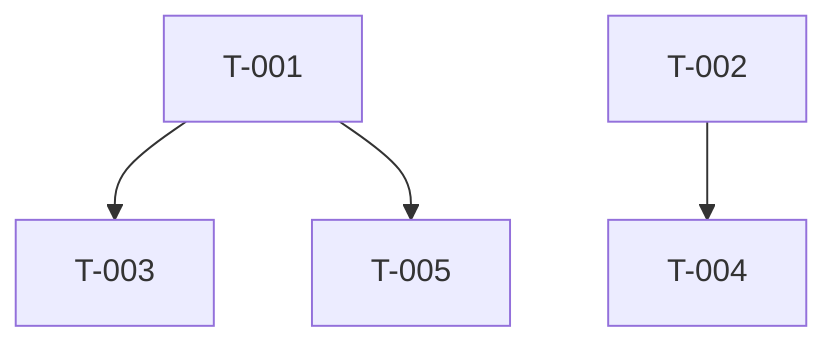

# 任务分配总表模板

```markdown
# 开发任务分配表

## 项目信息
- 项目名称：
- 项目模式：A-新建 / B-迭代
- 创建时间：

## 任务依赖拓扑



## 任务列表

| 任务ID | 任务名称 | 具体描述 | 开发实现细节 | 指派开发者 | 前置依赖 | 进度状态 | 开始时间 | 完成时间 |
|--------|---------|---------|------------|-----------|---------|---------|---------|---------|
| T-001  | ...     | ...     | ...        | 开发者A    | 无      | 待办    | ...     | ...     |
| T-002  | ...     | ...     | ...        | 开发者B    | 无      | 待办    | ...     | ...     |
| T-003  | ...     | ...     | ...        | 开发者A    | T-001   | 待办    | ...     | ...     |

## 进度汇总
- 总任务数：
- 已完成：
- 进行中：
- 待办：
- 完成率：
```

## JSON Schema

```json
{
  "projectName": "",
  "projectMode": "A",
  "createdAt": "",
  "tasks": [
    {
      "id": "T-001",
      "name": "",
      "description": "",
      "implementationDetails": "",
      "assignee": "",
      "dependencies": [],
      "status": "pending",
      "startedAt": null,
      "completedAt": null
    }
  ],
  "summary": {
    "total": 0,
    "completed": 0,
    "inProgress": 0,
    "pending": 0,
    "completionRate": "0%"
  }
}
```

## 状态定义

| 状态 | 标记 | 含义 |
|------|------|------|
| 待办 | pending | 尚未开始 |
| 进行中 | in_progress | 正在开发 |
| 完成 | completed | 开发完成且自验通过 |
